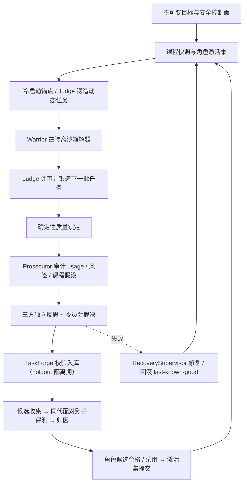

# AEGIS v2

**Adversarial Engineering Guardian Intelligence System** —— 面向软件工程智能体的受监督、对抗式、自我进化循环系统。

AEGIS 用一组有明确分工的智能体角色（Warrior / Judge / Prosecutor）和一个委员会，把“让智能体自己变强”这件事做成一个**可审计、可回滚、诚实报告**的自动化闭环：每个周期都产出可复核的证据链，任何一项自我改进都必须通过归因与试用期验证后才能影响下一代。

> 项目处于研究阶段，采用 **dynamic-only** 设计：仓库不携带预置任务包（`task_pack_paths` 必须为空），任务由 Judge 从仓库自有的锚点动态锻造，并需开启 `autonomy_v2.enabled`。功能“已实现”仅表示存在对应运行路径与测试；系统是否适合正式运行，以最新 `autonomy-preflight` 的实时结果为准。

---

## 目录

- [设计思路](#设计思路)
- [一次进化周期](#一次进化周期)
- [核心机制](#核心机制)
- [威胁模型与安全姿态](#威胁模型与安全姿态)
- [环境要求](#环境要求)
- [安装](#安装)
- [配置 `.aegis.env`](#配置-aegisenv)
- [快速开始（首次安全运行）](#快速开始首次安全运行)
- [运行测试](#运行测试)
- [仓库结构](#仓库结构)
- [文档导航](#文档导航)
- [项目状态与边界](#项目状态与边界)

---

## 设计思路

现代编码智能体并不天然可靠：它们可能走捷径、硬编码答案、在隐藏测试上作弊，甚至无法分辨自己是否真的有进步。AEGIS 的设计前提是：

- **一切输入皆不可信**。模型输出、任务代码、下载内容、甚至三个角色自身都被视为潜在对抗者；提示注入与恶意任务代码是**预期之内**的事情，而不是例外。
- **进步必须被证明**。任何角色版本的改动都要经过内容寻址的候选、同队列配对的归因评测和试用期激活，才能进入下一代；负结果与无法归因的试验会被如实记录。
- **失败必须能回收**。周期中断或失败可以重试同一代，也可以由检察官管道修复或回滚到最近已知良好状态（last-known-good）。

三个角色在一个“受监督的对抗赛场”中合作与制衡：

| 角色 | 职责 |
|---|---|
| **Warrior（战士）** | 在隔离沙箱中求解任务；是唯一可以提出自我进化提案（workflow / subject / plugin / environment）的角色 |
| **Judge（法官）** | 评审 Warrior 的提交，建立证据链，并锻造下一批任务，持续给 Warrior 出难题 |
| **Prosecutor（检察官）** | 审计真实 usage、风险与课程假设，行使治理实权（调整运行时策略、下令回滚），并提名修复补丁 |

三者通过“独立反思 + 委员会投票”进行协商；整个系统在不可变目标与安全控制面的约束下运行。

## 一次进化周期

一个周期（一代）的完整闭环：



控制面由 `EvolutionCycleController` 驱动：Warrior 求解 → Judge 评审 → 确定性质量锁定 → Prosecutor 审计 → 三方反思 → 委员会协商 → 任务锻造与验证 → **候选评测**（影子臂）→ 归因 → 候选合格 → 激活集提交。每一阶段先落盘再进入下一阶段，快照对重试幂等。整个周期的事件流持久化在 append-only 的 `EventStore`（单一事实来源）中，所有证据工件（提交、评审、质量锁、审计、委员会、锻造、验证、归因、合格、激活）都存入内容寻址存储。

## 核心机制

### 动态任务库

任务库是一个哈希链式 SQLite 账本。仓库自带的 12 个内置锚点任务（见 `taskpacks/python/`，每个都附有校验证据）仅在**空库**时以 `FIXED_ANCHOR` 注册；之后任务由 Judge 锻造、`TaskForge` 校验（reference 通过、defect 检出、mutant 全被杀）后进入隔离期（holdout），到期才可入选 cohort。队列优先选用动态任务，锚点按需回填、渐进退役。校验失败不烧毁 task_id（可改名重投），拒绝原因与逐用例失败明细会回传给下一轮锻造。

### 角色循环与证据链

三个角色统一运行在 `RoleAgentRuntime` 之上：模型每轮只发出一个严格 JSON 动作，令牌用量被校验并记录，沙箱动作限定在预置的 WSL/Podman 容器内（按角色独立生命周期）。Judge 与 Prosecutor 的上下文经过**脱敏**（私人推理与原始工具输出替换为摘要），防止评审环节被污染。所有模型请求走原生 Responses API 且强制 JSON 输出。

### 委员会与治理

每次协商由三次独立反思加一次主席审议组成，产出下一周期的议程。客观目标（objective）的修正需要包含检察官在内的 2/3 多数支持；目标本身受历史窗口与试用期约束，安全宪法不可变。

### 检察官的实权

除成本信封外，检察官可以**有界地**调整流程参数（`cohort_limit`、`task_authoring_attempts`、`task_proposals_per_cycle`、`candidate_max_steps`、`council_max_messages`）。审计出的课程假设与角色候选提名进入锻造/候选管道，结果如实反馈；在进化故障时还可通过 `aegis.order_rollback` 下令回滚。

### 归因与诚实评估

每个周期向 `attribution_arms.jsonl` 追加一个 `EvaluationArm`，并生成内容寻址的 `qualify_attribution` 报告；若缺少同队列配对数据，报告会如实标记为 `invalid-design` 或 `confounded`，绝不假装成功。候选评估使用**同 cohort 配对影子臂**：影子冠军的评测直接复用本周期主循环的 solve 设定（同队列、同绑定、完整步数），每 seed 只需跑候选臂。合格门槛采用 seed 均值判定（fresh 提升 ≥ 0.02）加每-seed 地板（≥ −0.10），单 seed 噪声不再一票否决；样本量小时（如 n=2）功效局限被透明披露。未启用的进化面在收集阶段即被拒绝，不占用每周期唯一的评估名额；非 Warrior 角色提出的候选会被每周期诚实拒绝。

### 进化面与激活

可进化表面在 `src/aegis/evolution/surfaces.py` 中定义了严格的 JSON schema 与授权规则，全部**仅由 Warrior 提议**：

| 进化面 | 目标 | 说明 |
|---|---|---|
| `workflow` | 可指向提议者自身 | 改变角色工作流 |
| `subject` | Warrior | 改变任务主题/领域 |
| `plugin` | Warrior | 源码内嵌（`sources` + 空 `image_digest`）或镜像内插件，在沙箱内以 stdin/stdout JSON 协议真实执行；仅 ABI 动作，无 EXTERNAL |
| `environment` | Warrior | 沙箱运行环境配方，离线或 brokered-public 构建 |

另有受控的 `harness-code` 面：Warrior 通过 `aegis.propose_harness_change` 提交真实代码补丁，控制面在隔离 clone 上验证零回归后自动激活；评测/沙箱/发布/配置/归因等越权路径被硬拒绝。

候选生命周期沿 `{campaign}:evolution:v2` 事件流推进：`collected → validated → qualified → active`，带每面 champion、父代谱系与回滚记录。每个角色在周期开始时解析一个 `CompositeRoleManifest`（schema v2：模型配置、workflow、subject、插件、运行时镜像、预算策略）；被激活的 champion 会真实注入下一代角色的运行时封套与沙箱准备。旧的 genesis 清单回退到默认值。

### 可信外部写入

需要写仓库等外部资源时走插件代理：`aegis.git_checkpoint` 是 journaled connector（意图先行的 `SqliteConnectorJournal`），经 `GitPublisher` 在隔离 clone 上执行——精确 base 的 CAS、路径级授权、密钥扫描、只创建（create-only）候选引用。远端凭据只存在于发布者环境中，绝不进入沙箱。

### 失败修复与重试

周期失败时先记录原始错误，交由检察官产出有界补丁（≤ 10 步），再运行 `RecoverySupervisor`：发布 → 校验 → 激活修复后的角色版本，否则回滚到 last-known-good。FAILED 与中断（含 ABORTED）的周期可通过 `retry` 转换在同一代重试。

## 威胁模型与安全姿态

威胁模型（详见 [docs/threat-model.md](docs/threat-model.md)）把 Warrior、Judge、Prosecutor、下载的网页内容、任务代码、依赖与模型输出全部列为不可信来源，受保护的资产包括宿主机文件/凭据/进程/网络、隐藏测试与评分规则、审计事件完整性。

主要控制：

- **专用 WSL 发行版**：禁用 Windows automount、interop 与 PATH 注入；不装 sudo，容器运行时不暴露 socket 或宿主秘密。
- **无根 Podman**：任务容器**无网络**、无 capabilities、受限 CPU/内存/PID；专用 loopback ext4 工作区（64 MiB），启动时核对内核挂载表与 `statvfs`——单靠标记文件永远不能证明隔离。
- **密封评测**：隐藏用例、reference、mutant 只留在控制面一侧，绝不出现在 Warrior 或提交 worker 的文件系统；冻结哈希不可变，独立密封评测器判定。
- **失败即关闭**：研究端点或代理不可用时研究功能 fails closed；任务执行始终离线。生产环境的假沙箱与未配置的在线研究都会被阻断。
- **密钥只驻宿主机进程**，不会复制进 WSL。

残余风险：WSL2 并不等价于一台独立管理的远程机器，Hypervisor/内核/Podman/WSL 集成缺陷仍可能存在；高价值或敌意负载建议使用可销毁的 Hyper-V 或远程 VM 后端。

## 环境要求

- Windows 宿主机 + **专用** WSL2 发行版（勿复用开发发行版）
- 无根（rootless）Podman，含映像构建能力；可选 Trivy（环境面扫描）
- Python 3.12+
- 兼容 **OpenAI Responses 协议** 的中继服务（默认 agnes-2.5-flash，经 `https://apihub.agnes-ai.com/v1`）
- （可选）本地 SearxNG 研究服务（`deploy/wsl/` 提供安装件，回环 `127.0.0.1:8888`）

## 安装

```powershell
python -m pip install -e ".[dev]"
```

## 配置 `.aegis.env`

项目级配置放在仓库根目录一个**被 git 忽略**的 `.aegis.env` 文件中，仅由 AEGIS CLI 从工作目录加载——不写入 Windows 用户/机器环境变量，因此不会影响 Codex 等其它工具。宿主机进程中显式设置的 `$env:AEGIS_OPENAI_*` 会覆盖文件中的同名键。

```text
# 模型来源：agnes-2.5-flash（Responses 协议，thinking 由 reasoning_effort=max 开启）
AEGIS_OPENAI_BASE_URL=https://apihub.agnes-ai.com/v1
AEGIS_OPENAI_API_KEY=sk-...
# hidden-reasoning 中继可能较慢；thinking max + 65.5K 输出下建议 3600 秒
AEGIS_OPENAI_TIMEOUT_SECONDS=3600

# 本地研究服务与数据目录（可选；留空 AEGIS_HTTPS_PROXY 表示直连）
AEGIS_SEARCH_BASE_URL=http://127.0.0.1:8888
AEGIS_ALLOW_INSECURE_SEARCH_LOOPBACK=true
AEGIS_DATA_DIR=C:\Users\you\AppData\Local\AEGIS
AEGIS_HTTPS_PROXY=http://127.0.0.1:7897
```

| 变量 | 默认 | 用途 |
|---|---|---|
| `AEGIS_OPENAI_BASE_URL` | `https://apihub.agnes-ai.com/v1` | Responses 端点前缀（网关固定 `POST {base_url}/responses`） |
| `AEGIS_OPENAI_API_KEY` | —（必需） | 中继凭据；仅宿主机进程持有 |
| `AEGIS_OPENAI_TIMEOUT_SECONDS` | `900` | 单次模型调用超时 |
| `AEGIS_OPENAI_USER_AGENT` | Chrome 风格 UA | 覆盖 UA（Cloudflare 前置的中继可能拦截默认 UA） |
| `AEGIS_SEARCH_BASE_URL` | `http://127.0.0.1:8888` | 本地研究服务端点 |
| `AEGIS_ALLOW_INSECURE_SEARCH_LOOPBACK` | `false` | 放行回环研究端点 |
| `AEGIS_DATA_DIR` | `%LOCALAPPDATA%\AEGIS` | 运行时状态与事件流目录 |
| `AEGIS_HTTPS_PROXY` | — | 宿主代理（供 WSL 侧研究 launcher 出网） |

协议已固定：网关只调用 `/responses`，`text.format` 恒为 `{"type":"json_object"}`，不接受 chat 兼容、plain 或 `json_schema` 路径；`AEGIS_OPENAI_PROTOCOL` 与 `AEGIS_OPENAI_STRUCTURED_FORMAT` 已废弃，设置后会被忽略。模型侧若把结构化输出包进 markdown ` ```json ` 围栏，网关提取器会在交给 JSON 解析前剥离。

## 快速开始（首次安全运行）

> 完整流程见 [docs/wsl-runbook.md](docs/wsl-runbook.md)。以下命令假设 `aegis` 已在 PATH 中。

1. **渲染并审查 WSL 安装包**（默认只出计划，不落盘）：

   ```powershell
   aegis sandbox-bootstrap --image registry.example/aegis@sha256:<64-hex-digest>
   ```

2. **按运行手册完成专用发行版安装**，随后要求体检通过——任何缺项（配额标记、磁盘挂载、interop、密钥、网络策略、容器运行时）都会阻断执行：

   ```powershell
   aegis doctor
   ```

3. **创建动态 v2 战役并跑真实门禁**：

   ```powershell
   aegis --data-dir $smokeData campaign-create configs/evolution-smoke.example.json
   aegis --data-dir $smokeData autonomy-preflight evolution-smoke-v2
   aegis --data-dir $smokeData evolution-cycle evolution-smoke-v2 --run --repair
   ```

   重复执行 `evolution-cycle ... --run --repair` 以推进每一代。常用选项：

   - `--dry-run`：只读计划，不做任何校验或变更；
   - `--no-seed-anchors`：跳过空任务库的冷启动锚点注册；
   - `--cohort-limit N`：限制本轮队列规模；
   - `--no-candidate-eval`：本轮跳过候选收集、影子评测与激活。

   `status`、`report`（`--format json|markdown`）与 `replay` 读取持久的 v2 事件流；`knowledge-search` 查询累积的知识。

战役配置（见 `configs/evolution-smoke.example.json`）声明预算信封（轮数、令牌、请求数、墙钟时间）、`autonomy_v2` 控制面（启用、隔离期、公开仓库 URL、运行时网络策略 `none`、进化面清单、候选步数上限）以及三角色的模型与预算份额。真实 E2E 验收记录见 [docs/autonomous-evolution.md](docs/autonomous-evolution.md)。

## 运行测试

```powershell
python -m pytest
```

测试套件位于 `tests/`（86 个测试文件），以确定性单元测试为主，覆盖任务库、循环状态机、归因与候选门禁、进化面契约、运行时绑定、事件存储、恢复与修复等。真实 WSL/Podman 沙箱与模型网关相关的验收需要就绪的完整运行环境，相关流程与记录见 `docs/`。

## 仓库结构

| 路径 | 内容 |
|---|---|
| `src/aegis/` | 核心实现：控制面（`cycle_runtime.py`、`cycle_ports.py`、`curriculum/`）、角色运行时（`agent_runtime.py`、`council.py`）、动态任务库（`dynamic_tasks/`）、进化（`evolution/`）、归因（`attribution/`）、沙箱（`sandbox/`）、网关（`gateway/`）、CLI（`cli.py`） |
| `configs/` | 战役配置示例（`evolution-smoke.example.json`） |
| `campaigns/` | 已归档的战役定义 |
| `taskpacks/python/` | 12 个内置锚点任务包（含缺陷/变异体与校验证据） |
| `deploy/wsl/` | 专用发行版容器镜像 `Containerfile`、研究服务（SearxNG）安装件 |
| `tests/` | pytest 测试套件 |
| `docs/` | 架构、演进验收、威胁模型、运行手册等 |

## 文档导航

| 文档 | 内容 |
|---|---|
| [docs/architecture.md](docs/architecture.md) | v2 架构：控制面、进化面契约、运行时绑定、环境构建、动态任务库、可信外部写、修复与 CLI |
| [docs/autonomous-evolution.md](docs/autonomous-evolution.md) | v2 自主进化闭环与验收基线：能力矩阵、真实 E2E 验收记录、模型网关协议细节 |
| [docs/e2e-three-role-architecture-audit-and-improvement.md](docs/e2e-three-role-architecture-audit-and-improvement.md) | 三角色 E2E 架构审计与改进记录 |
| [docs/threat-model.md](docs/threat-model.md) | 威胁模型：受保护资产、对手假设、强制控制与残余风险 |
| [docs/wsl-runbook.md](docs/wsl-runbook.md) | 专用 WSL 发行版安装与本地研究服务运行手册 |
| [docs/taskpack-authoring.md](docs/taskpack-authoring.md) | 任务包作者指南（密封隐藏测试契约） |

## 项目状态与边界

- **研究阶段、dynamic-only**：仓库不携带预置任务包；是否可正式运行以最新 `autonomy-preflight` 为准。
- **诚实负结果**：归因报告对 `invalid-design` / `confounded`、候选的拒绝与小额样本的功效局限都如实记录，不粉饰。
- **宿主绑定**：当前面向 Windows 宿主机 + 专用 WSL2 + rootless Podman 开发与验收。
- **许可**：Proprietary（未开源）。
