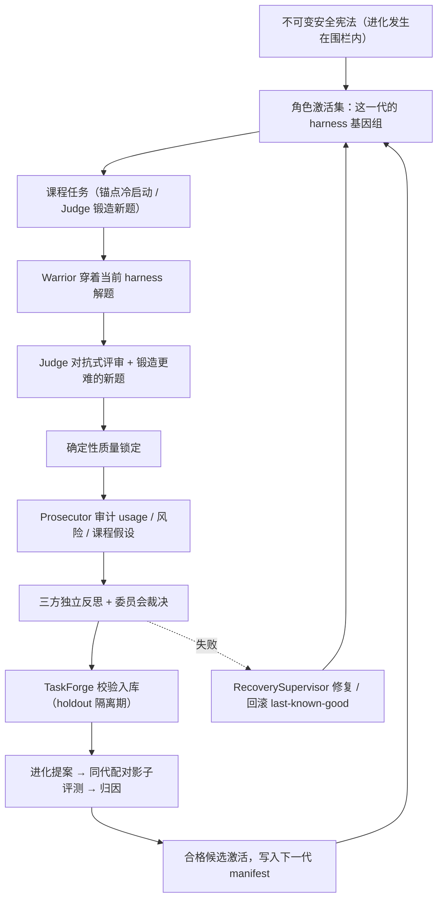

# AEGIS v2

**Adversarial Evolutionary Generative Intelligence System** —— 一个让智能体在任务循环中**自己改造自己的 harness**、从而持续进化的系统。

大模型的权重决定它的潜力，但一个智能体实际表现出什么能力，取决于它穿在模型外面的整套装备：工作流（怎么组织解题）、主题设定（以什么视角理解任务）、插件（手上有什么工具）、运行环境（沙箱里装了什么）、以及支撑这一切的 harness 代码本身。AEGIS 的核心主张是：**冻结权重，进化 harness**。把这些装备全部建模为可版本化、可评测、可回滚的"进化表面"，让智能体在自己的任务循环中提出改造方案，由对抗式评审与真实评测构成的证据门控决定改造能否被采纳、能否传给下一代。

> 项目处于研究阶段，采用 **dynamic-only** 设计：仓库不携带预置任务包（`task_pack_paths` 必须为空），任务由 Judge 从仓库自有的锚点动态锻造，并需开启 `autonomy_v2.enabled`。功能"已实现"仅表示存在对应运行路径与测试；系统是否适合正式运行，以最新 `autonomy-preflight` 的实时结果为准。

---

## 目录

- [核心理念：harness 是第一进化基质](#核心理念harness-是第一进化基质)
- [可进化的表面](#可进化的表面)
- [进化循环全景](#进化循环全景)
- [对抗式三角色：选择压力的来源](#对抗式三角色选择压力的来源)
- [证据门控：进化的适应度函数](#证据门控进化的适应度函数)
- [围栏内的进化](#围栏内的进化)
- [环境要求](#环境要求)
- [安装](#安装)
- [配置 `.aegis.env`](#配置-aegisenv)
- [快速开始（首次安全运行）](#快速开始首次安全运行)
- [运行测试](#运行测试)
- [仓库结构](#仓库结构)
- [文档导航](#文档导航)
- [项目状态与边界](#项目状态与边界)

---

## 核心理念：harness 是第一进化基质

### 为什么进化 harness，而不是权重

让智能体变强有两条路。一条是继续训练模型——但梯度更新是黑盒、昂贵且不可审查的，每次"进步"都无法被 diff，出错也无法局部回滚。另一条路是承认：**在权重冻结的前提下，智能体的能力上限由它的 harness 决定**，而 harness 是纯粹的软件工程对象。AEGIS 选择第二条路：

- 每次自我改进都产出一个**内容寻址的候选工件**——一段可读、可审查、可配对评测的代码或配置，而不是一坨新的权重；
- 改坏了可以**回滚到 last-known-good**，改好了可以沿着谱系追溯它解决了哪一代的哪类失败；
- 更重要的是：编码智能体的典型失败——硬编码答案、状态泄漏、并发错误、不安全的路径处理——大多发生在 harness 层面。工作流缺一个强制验证步骤、工具少一道防护、环境没暴露正确的检查点。**这些弱点恰恰是身在循环中的 Agent 自己最能诊断、也最应该自己动手修的东西。**

于是进化的主体和被进化的对象在 AEGIS 里是同一个：解题的 Warrior 提出改造，改造的产物又穿回 Warrior 身上。这就是"自己改造自己的 harness"。

### 进化闭环的四个环节

1. **暴露**：Warrior 穿着当前 harness 在隔离沙箱中解题，每一次失败、绕路和低效都被完整记录进周期证据链——弱点不是靠想象发现的，是被任务逼出来的。
2. **提案**：改进的动机来自实践。只有真正在沙箱里干活的 Warrior 有资格提出进化提案（`evolution.request`）；旁观者（Judge、Prosecutor）的提名会被诚实拒绝——它们可以诊断问题，但只有承担后果的角色才能改自己的装备。
3. **裁决**：提案被物化为候选，在**同一批任务、同一绑定、只差 harness 这一个变量**的条件下跑同代配对影子评测，归因报告回答"这次改造真的有用吗"。分不开就承认 `confounded`，样本太小就披露功效局限——负结果也是结果。
4. **遗传**：通过门控的候选被激活进角色的 `CompositeRoleManifest`，下一代 Warrior 出生时就穿着新装备；未通过的候选留在谱系里，不消耗未来的机会。

### harness 与课程的共同进化

静态基准会被过拟合，自我评估会自我强化。AEGIS 用一个会出题的对手替代静态基准：Judge 每个周期锻造新任务（经 reference/defect/mutant 三重校验后隔离入库），任务难度随着 Warrior 装备的升级水涨船高。**题目在变难，装备在变强**——这是一个双向的军备竞赛，适应度永远锚定在"当前课程下的真实表现"，而不是某个可以被背下来的固定题库。锚点任务只在空库时冷启动，之后渐进退役，系统最终完全运行在自己给自己出的题上。

## 可进化的表面

`src/aegis/evolution/surfaces.py` 为每类 harness 改造定义了严格的 JSON schema 与授权规则。全部表面**仅由 Warrior 提议**，插件/环境/主题只能面向 Warrior 自身：

| 进化面 | 改造的是什么 | 形态 |
|---|---|---|
| `workflow` | 角色的解题流程（阶段计划、步骤组织） | 内容寻址工作流工件 |
| `subject` | 任务主题与视角设定 | 主题工件 |
| `plugin` | 手上的工具：源码内嵌（`sources` + 空 `image_digest`）或镜像插件，在沙箱内以 stdin/stdout JSON 协议**真实执行**；仅 ABI 动作 | 插件工件 |
| `environment` | 沙箱运行环境配方（digest-pinned 基础镜像 + 离线/brokered-public 构建，双构建 digest 一致 + Trivy 扫描作为证据） | 环境 receipt 工件 |
| `harness-code`（受控） | **进化控制代码本身**：Warrior 经 `aegis.propose_harness_change` 提交真实代码补丁；控制面在隔离 clone 上验证 checkpoint 树一致、compile/import 冒烟、基线与候选双金丝雀零回归后才激活并提交到真实 harness 仓库 | Git checkpoint + 补丁 |

`harness-code` 面是这条理念走得最远的地方：连"决定谁能进化、怎么评测"的那部分代码，本身也在进化射程之内（需 `meta_evolution_enabled` 显式授权，且沙箱/发布/评测/归因边界永不开禁）。候选生命周期沿 `{campaign}:evolution:v2` 事件流推进：`collected → validated → qualified → active`，带每面 champion、父代谱系与回滚记录。

## 进化循环全景

一个周期（一代）= 一次完整的"暴露 → 提案 → 裁决 → 遗传"：



控制面由 `EvolutionCycleController` 驱动，每一阶段先落盘再进入下一阶段，快照对重试幂等；整个事件流持久化在 append-only 的 `EventStore`（单一事实来源）中。失败或中断（含 ABORTED）的周期可以 `retry` 同一代理赔，或走检察官修复管道（发布 → 校验 → 激活，否则回滚）。

## 对抗式三角色：选择压力的来源

单一智能体自我改进最大的陷阱是**自我强化回路**：自己出题、自己打分、自己表扬自己。AEGIS 把循环拆给三个利益相互制衡的角色：

| 角色 | 职责 | 制衡的是谁 |
|---|---|---|
| **Warrior（战士）** | 穿着当前 harness 在隔离沙箱解题；唯一有权提出进化提案的角色 | —— |
| **Judge（法官）** | 对抗式评审提交（上下文经脱敏，看不到私人推理原文），建立证据链；并锻造下一批更难的任务 | Warrior 的自我评估 |
| **Prosecutor（检察官）** | 审计真实 usage、风险与课程假设；有界调整运行时策略；进化故障时下令回滚 | Warrior 与 Judge 的合谋空间 |

协商采用"三次独立反思 + 一次主席审议"的委员会机制，客观目标的修正需要**包含检察官在内的 2/3 多数**——单靠解题方和出题方无法改写系统的追求。检察官的实权有界且全程留痕（`cohort_limit`、`candidate_max_steps` 等参数调整均在界内），它审计出的课程假设会进入锻造管道，结果如实反馈。

三角色统一运行在 `RoleAgentRuntime` 之上：模型每轮只发出一个严格 JSON 动作，令牌用量被校验并记录，沙箱动作限定在按角色独立生命周期的 WSL/Podman 容器内。所有模型请求走原生 Responses API 且强制 JSON 输出。

## 证据门控：进化的适应度函数

进化系统的好坏最终取决于适应度函数是否诚实。AEGIS 用**同 cohort 配对影子评测**回答"这个 harness 改动真的有用吗"：

- **冠军基线零额外成本**：影子评测的基线直接复用本周期主循环的 solve——同队列、同绑定、完整步数，每 seed 只需跑候选臂；
- **双臂步数对齐**：候选臂可获得有限额外步数（`candidate_max_extra_steps=24`），preflight 校验不超过 `max_agent_steps`，候选不会靠"更多步数"作弊；
- **门槛抗噪**：seed 均值提升 ≥ 0.02 且每-seed 地板 ≥ −0.10，单 seed 噪声不再一票否决；小样本（如 n=2）的功效局限被透明披露；
- **归因诚实**：每周期向 `attribution_arms.jsonl` 追加 `EvaluationArm` 账本并生成内容寻址归因报告；缺少配对数据时如实标记 `invalid-design` / `confounded`，不伪装成成功；
- **机会成本受控**：未启用的进化面在收集阶段即被拒绝，不占用每周期唯一的评估名额；非 Warrior 提名被逐周期诚实拒绝。

激活不是终点：候选进入试用期（probation）观察，目标受历史窗口约束；环境候选的构建 receipt（两次独立构建 digest 一致 + 扫描证据）物化到候选上，激活后 `runtime_image` 被 digest 钉死，后续代际的沙箱 prepare 直接使用新镜像。

## 围栏内的进化

进化发生在围栏内——这是上述一切得以诚实的物理前提，而非项目的主要卖点。威胁模型（[docs/threat-model.md](docs/threat-model.md)）把三个角色、任务代码、下载内容与模型输出全部视为不可信，主要控制：

- **专用 WSL 发行版**：禁用 Windows automount、interop 与 PATH 注入；
- **无根 Podman**：任务容器**无网络**、无 capabilities、受限 CPU/内存/PID；专用 loopback ext4 工作区，启动核对内核挂载表而非仅看标记文件；
- **密封评测**：隐藏用例、reference、mutant 只留在控制面一侧，绝不出现在 Warrior 文件系统；冻结哈希不可变；
- **可信外部写入**：`aegis.git_checkpoint` 走意图先行的 journaled connector，经隔离 clone + 路径授权 + 密钥扫描 + create-only 引用发布；
- **失败即关闭**：研究服务或代理不可用时研究功能 fails closed，任务执行始终离线；密钥只驻宿主机进程，绝不进入 WSL。

残余风险：WSL2 不等价于独立管理的远程机器；高价值或敌意负载建议使用可销毁的 Hyper-V 或远程 VM 后端。

## 环境要求

- Windows 宿主机 + **专用** WSL2 发行版（勿复用开发发行版）
- 无根（rootless）Podman，含映像构建能力；可选 Trivy（环境面扫描）
- Python 3.12+
- 兼容 **OpenAI Responses 协议** 的中继服务（默认 agnes-2.5-flash，经 `https://apihub.agnes-ai.com/v1`）
- （可选）本地 SearxNG 研究服务（`deploy/wsl/` 提供安装件，回环 `127.0.0.1:8888`）

## 安装

```powershell
python -m pip install -e ".[dev]"
```

## 配置 `.aegis.env`

项目级配置放在仓库根目录一个**被 git 忽略**的 `.aegis.env` 文件中，仅由 AEGIS CLI 从工作目录加载——不写入 Windows 用户/机器环境变量，因此不会影响 Codex 等其它工具。宿主机进程中显式设置的 `$env:AEGIS_OPENAI_*` 会覆盖文件中的同名键。

```text
# 模型来源：agnes-2.5-flash（Responses 协议，thinking 由 reasoning_effort=max 开启）
AEGIS_OPENAI_BASE_URL=https://apihub.agnes-ai.com/v1
AEGIS_OPENAI_API_KEY=sk-...
# hidden-reasoning 中继可能较慢；thinking max + 65.5K 输出下建议 3600 秒
AEGIS_OPENAI_TIMEOUT_SECONDS=3600

# 本地研究服务与数据目录（可选；留空 AEGIS_HTTPS_PROXY 表示直连）
AEGIS_SEARCH_BASE_URL=http://127.0.0.1:8888
AEGIS_ALLOW_INSECURE_SEARCH_LOOPBACK=true
AEGIS_DATA_DIR=C:\Users\you\AppData\Local\AEGIS
AEGIS_HTTPS_PROXY=http://127.0.0.1:7897
```

| 变量 | 默认 | 用途 |
|---|---|---|
| `AEGIS_OPENAI_BASE_URL` | `https://apihub.agnes-ai.com/v1` | Responses 端点前缀（网关固定 `POST {base_url}/responses`） |
| `AEGIS_OPENAI_API_KEY` | —（必需） | 中继凭据；仅宿主机进程持有 |
| `AEGIS_OPENAI_TIMEOUT_SECONDS` | `900` | 单次模型调用超时 |
| `AEGIS_OPENAI_USER_AGENT` | Chrome 风格 UA | 覆盖 UA（Cloudflare 前置的中继可能拦截默认 UA） |
| `AEGIS_SEARCH_BASE_URL` | `http://127.0.0.1:8888` | 本地研究服务端点 |
| `AEGIS_ALLOW_INSECURE_SEARCH_LOOPBACK` | `false` | 放行回环研究端点 |
| `AEGIS_DATA_DIR` | `%LOCALAPPDATA%\AEGIS` | 运行时状态与事件流目录 |
| `AEGIS_HTTPS_PROXY` | — | 宿主代理（供 WSL 侧研究 launcher 出网） |

协议已固定：网关只调用 `/responses`，`text.format` 恒为 `{"type":"json_object"}`，不接受 chat 兼容、plain 或 `json_schema` 路径；`AEGIS_OPENAI_PROTOCOL` 与 `AEGIS_OPENAI_STRUCTURED_FORMAT` 已废弃，设置后会被忽略。模型侧若把结构化输出包进 markdown ` ```json ` 围栏，网关提取器会在交给 JSON 解析前剥离。

## 快速开始（首次安全运行）

> 完整流程见 [docs/wsl-runbook.md](docs/wsl-runbook.md)。以下命令假设 `aegis` 已在 PATH 中。

1. **渲染并审查 WSL 安装包**（默认只出计划，不落盘）：

   ```powershell
   aegis sandbox-bootstrap --image registry.example/aegis@sha256:<64-hex-digest>
   ```

2. **按运行手册完成专用发行版安装**，随后要求体检通过——任何缺项（配额标记、磁盘挂载、interop、密钥、网络策略、容器运行时）都会阻断执行：

   ```powershell
   aegis doctor
   ```

3. **创建动态 v2 战役并跑真实门禁**：

   ```powershell
   aegis --data-dir $smokeData campaign-create configs/evolution-smoke.example.json
   aegis --data-dir $smokeData autonomy-preflight evolution-smoke-v2
   aegis --data-dir $smokeData evolution-cycle evolution-smoke-v2 --run --repair
   ```

   重复执行 `evolution-cycle ... --run --repair` 以推进每一代。常用选项：

   - `--dry-run`：只读计划，不做任何校验或变更；
   - `--no-seed-anchors`：跳过空任务库的冷启动锚点注册；
   - `--cohort-limit N`：限制本轮队列规模；
   - `--no-candidate-eval`：本轮跳过候选收集、影子评测与激活。

   `status`、`report`（`--format json|markdown`）与 `replay` 读取持久的 v2 事件流；`knowledge-search` 查询累积的知识。

战役配置（见 `configs/evolution-smoke.example.json`）声明预算信封（轮数、令牌、请求数、墙钟时间）、`autonomy_v2` 控制面（启用、隔离期、公开仓库 URL、运行时网络策略 `none`、进化面清单、候选步数上限）以及三角色的模型与预算份额。真实 E2E 验收记录见 [docs/autonomous-evolution.md](docs/autonomous-evolution.md)。

## 运行测试

```powershell
python -m pytest
```

测试套件位于 `tests/`（86 个测试文件），以确定性单元测试为主，覆盖任务库、循环状态机、归因与候选门禁、进化面契约、运行时绑定、事件存储、恢复与修复等。真实 WSL/Podman 沙箱与模型网关相关的验收需要就绪的完整运行环境，相关流程与记录见 `docs/`。

## 仓库结构

| 路径 | 内容 |
|---|---|
| `src/aegis/` | 核心实现：控制面（`cycle_runtime.py`、`cycle_ports.py`、`curriculum/`）、角色运行时（`agent_runtime.py`、`council.py`）、动态任务库（`dynamic_tasks/`）、进化（`evolution/`）、归因（`attribution/`）、沙箱（`sandbox/`）、网关（`gateway/`）、CLI（`cli.py`） |
| `configs/` | 战役配置示例（`evolution-smoke.example.json`） |
| `campaigns/` | 已归档的战役定义 |
| `taskpacks/python/` | 12 个内置锚点任务包（含缺陷/变异体与校验证据） |
| `deploy/wsl/` | 专用发行版容器镜像 `Containerfile`、研究服务（SearxNG）安装件 |
| `tests/` | pytest 测试套件 |
| `docs/` | 架构、演进验收、威胁模型、运行手册等 |

## 文档导航

| 文档 | 内容 |
|---|---|
| [docs/architecture.md](docs/architecture.md) | v2 架构：控制面、进化面契约、运行时绑定、环境构建、动态任务库、可信外部写、修复与 CLI |
| [docs/autonomous-evolution.md](docs/autonomous-evolution.md) | v2 自主进化闭环与验收基线：能力矩阵、真实 E2E 验收记录、模型网关协议细节 |
| [docs/e2e-three-role-architecture-audit-and-improvement.md](docs/e2e-three-role-architecture-audit-and-improvement.md) | 三角色 E2E 架构审计与改进记录 |
| [docs/threat-model.md](docs/threat-model.md) | 威胁模型：受保护资产、对手假设、强制控制与残余风险 |
| [docs/wsl-runbook.md](docs/wsl-runbook.md) | 专用 WSL 发行版安装与本地研究服务运行手册 |
| [docs/taskpack-authoring.md](docs/taskpack-authoring.md) | 任务包作者指南（密封隐藏测试契约） |

## 项目状态与边界

- **研究阶段、dynamic-only**：仓库不携带预置任务包；是否可正式运行以最新 `autonomy-preflight` 为准。
- **非 RL 的进化**：不动权重、没有梯度；选择压力来自对抗式评审与证据门控的激活决策，全部基于行为表现。
- **诚实负结果**：归因报告对 `invalid-design` / `confounded`、候选的拒绝与小额样本的功效局限都如实记录，不粉饰。
- **宿主绑定**：当前面向 Windows 宿主机 + 专用 WSL2 + rootless Podman 开发与验收。
- **许可**：Proprietary（未开源）。
