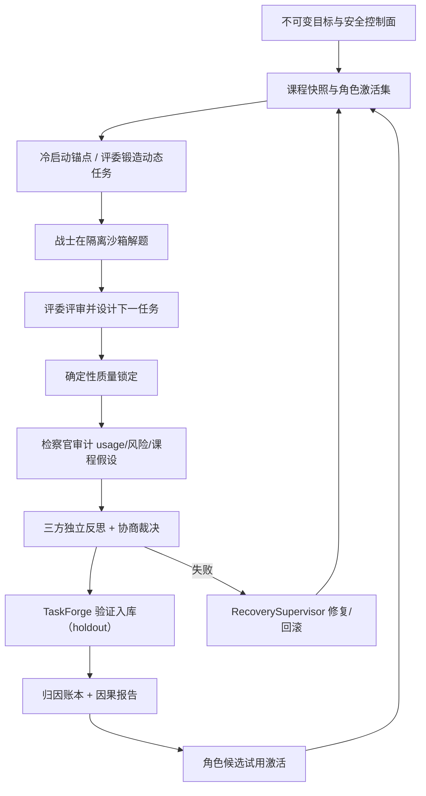

# AEGIS v2 自主进化架构与验收基线

## 1. 文档目的

本文描述 AEGIS v2 动态三角色自主进化系统的实现边界与验收基线。v1 的固定 12
题轮次控制器、策略/skill/代码候选晋升漏斗与对应 CLI 命令已移除；当前设计为
dynamic-only（`task_pack_paths` 必须为空，`autonomy_v2.enabled=true`）。
“已实现”仅表示存在对应运行路径与测试；系统是否适合正式运行以最新版
`autonomy-preflight` 的实时结果为准。

## 2. 完整闭环

## 3. 已实现能力

| 能力 | 实现 | 主要源码 | 主要测试 |
|---|---|---|---|
| 动态任务冷启动 | 空库时注册 12 个内置锚点，动态任务可用后锚点退出 | `dynamic_tasks/seed.py`、`registry.py` | `test_dynamic_seed.py` |
| 评委自主出题 | 模型端口产出 proposal 或 base64 tar 归档，经 TaskForge 变异验证入库 | `cycle_ports.py`、`dynamic_tasks/forge.py` | `test_cycle_ports.py` |
| 模型驱动全循环 | Warrior/Judge/Prosecutor 经 RoleAgentRuntime 运行，逐阶段落盘 | `cycle_runtime.py`、`cycle_ports.py` | `test_cycle_runtime.py`、`test_cycle_ports.py` |
| 三方协商 | 三个独立反思 + 集体裁决 | `cycle_ports.py` | `test_cycle_ports.py` |
| Git checkpoint | journaled connector + GitPublisher CAS candidate ref（需配置 public_repo_url） | `connectors/`、`publishing/` | `test_git_checkpoint_connector.py` |
| 归因与课程层 | 每 cycle 追加 EvaluationArm 账本，产出内容寻址归因报告 | `attribution/`、`cycle_ports.py` | `test_attribution_v2.py` |
| 角色试用进化 | 检察官提出 role_candidates 时经 RoleRegistry collect→validate→qualify→commit | `cycle_ports.py`、`roles/registry.py` | `test_cycle_ports.py` |
| 失败修复与重试 | 失败记录错误并走 RecoverySupervisor；FAILED/中断态可 retry 同代 | `cycle_recovery.py`、`repair_runtime.py`、`curriculum/state_machine.py` | `test_cycle_recovery.py`、`test_cycle_runtime.py` |
| CLI/状态 | `evolution-cycle`（dry-run/run/repair）、`autonomy-preflight`（v2 门禁）、status/report/replay | `cli.py` | `test_cli.py` |

## 4. 真实两代 smoke 验收记录（2026-08-10）

真实 WSL/Podman + 真实模型网关连续两代 `evolution-cycle --run --repair` 均以
`completed` 收尾；每代产出 submission、judge-review、quality-lock、
prosecutor-audit、council、task-forge、task-validation、attribution、
qualification、activation 十类证据 artifact。`autonomy-preflight` 全部 v2
门禁通过。运行中修复了三类真实问题：preflight 的 v1 形状检查与 v2 冲突（新增
v2 分支）、cycle 沙箱未走 doctor/prepare 生命周期（补齐并加随机沙箱 id 与冲突
重试）、FAILED/中断态无法续跑（新增 retry 与快照同代幂等）。验证数据位于
`C:\Users\XKZ\Documents\VSCode Projects\AEGIS\.smoke-data-v3`，配置为
`configs/evolution-smoke.example.json`。

## 5. 信任边界

- 模型不能修改权限、预算、隐藏测试、评分、沙箱或晋升门。
- 外部内容进入长期存储或候选执行前必须有最终 URL、内容哈希、大小与固定版本。
- 任务容器与发布器分离；任务容器保持无网络。
- 任何外部写只能经 journaled connector；凭据留在发布者环境。
- token、请求失败与重试都必须记账，不只统计成功响应。

## 6. 边界与后续项

- 评委直接产出可执行 task-pack 归档依赖模型输出 base64 tar；否则走声明式
  proposal，由可信构建器后续物化。
- 跨 cycle 角色对比被归因模型如实判为 confounded；完整因果归因需要同 cohort
  的冠军/候选配对实验。
- `RecoverySupervisor` 的发布器在未配置 `public_repo_url` 时使用确定性 CAS
  发布器（测试/无远端模式）。
