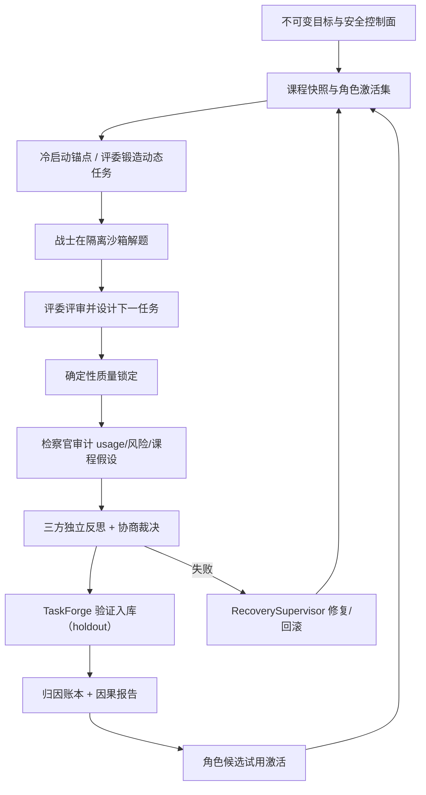

# AEGIS v2 自主进化架构与验收基线

## 1. 文档目的

本文描述 AEGIS v2 动态三角色自主进化系统的实现边界与验收基线。v1 的固定 12
题轮次控制器、策略/skill/代码候选晋升漏斗与对应 CLI 命令已移除；当前设计为
dynamic-only（`task_pack_paths` 必须为空，`autonomy_v2.enabled=true`）。
“已实现”仅表示存在对应运行路径与测试；系统是否适合正式运行以最新版
`autonomy-preflight` 的实时结果为准。

## 2. 完整闭环

## 3. 已实现能力

| 能力 | 实现 | 主要源码 | 主要测试 |
|---|---|---|---|
| 动态任务冷启动 | 空库时注册 12 个内置锚点，动态任务可用后锚点退出 | `dynamic_tasks/seed.py`、`registry.py` | `test_dynamic_seed.py` |
| 评委自主出题 | Judge 在 submit payload 声明 task_specs（纯文本/JSON），控制面 TaskPackBuilder 生成布局/manifest/content_hash、预检 task_id、dry-run 校验并原子入库 | `cycle_ports.py`、`dynamic_tasks/builder.py`、`dynamic_tasks/forge.py` | `test_taskpack_builder.py`、`test_cycle_ports.py` |
| 模型驱动全循环 | Warrior/Judge/Prosecutor 经 RoleAgentRuntime 运行，逐阶段落盘 | `cycle_runtime.py`、`cycle_ports.py` | `test_cycle_runtime.py`、`test_cycle_ports.py` |
| 三方协商 | 三个独立反思 + 集体裁决 | `cycle_ports.py` | `test_cycle_ports.py` |
| Git checkpoint | journaled connector + GitPublisher CAS candidate ref（需配置 public_repo_url） | `connectors/`、`publishing/` | `test_git_checkpoint_connector.py` |
| 归因与课程层 | 每 cycle 追加 EvaluationArm 账本，产出内容寻址归因报告 | `attribution/`、`cycle_ports.py` | `test_attribution_v2.py` |
| 可进化面契约 | workflow/subject/plugin/environment 四类表面，严格 schema 与授权规则；仅 Warrior 可提议，插件/环境/主题只能面向 Warrior | `evolution/surfaces.py` | `test_evolution_surfaces.py` |
| Harness 代码进化 | `harness-code` 代码面：Warrior 以 `aegis.propose_harness_change` 提交真实代码补丁 + checkpoint 引用；控制面在隔离 Git clone 上验证 checkpoint 树一致、compile/import 冒烟、基线与候选双金丝雀零回归，通过后自动激活并把补丁提交到真实 harness 仓库；越权路径（评测/沙箱/发布/配置/归因）硬拒绝 | `evolution/surfaces.py`、`evolution/harness.py`、`cycle_ports.py`、`agent_runtime.py` | `test_evolution_harness.py` |
| 检察官监督回滚 | 进化故障时检察官经 `aegis.order_rollback` 发回滚令；控制面校验回滚目标确为当前 champion 后，`HarnessRollbackExecutor` 对真实仓库 `git reset --hard` 到已认证祖先提交，并同步 `EvolutionRegistry` 回滚到上一 champion，全程事件落盘 | `evolution/harness.py`、`cycle_ports.py`、`agent_runtime.py`、`evolution/consumer.py` | `test_evolution_harness.py`（三代 e2e：激活 A→激活 B→回滚 B） |
| MCP 桥接 | 控制面 MCP JSON-RPC 2.0 桥（HTTPS 或回环 HTTP）：`aegis.deploy_mcp` 实时 `tools/list` 校验后注册，`aegis.mcp_call` 经桥调用已授权工具，结果大小受限；沙箱保持离线 | `mcp/bridge.py`、`agent_runtime.py`、`cycle_ports.py` | `test_mcp_subagents.py` |
| 依赖部署 | `aegis.deploy_dependency` 把 digest-pinned HTTPS 依赖组装为 brokered-public 环境配方，复用既有双构建+Trivy+CAS 激活管线 | `agent_runtime.py`、`evolution/surfaces.py` | `test_evolution_harness.py`（surface 校验）、`test_evolution_env_builder.py` |
| 子代理运行时 | `aegis.spawn_subagent`/`reclaim_subagent`/`subagent_status` 启动真实受限 worker 进程（`python -m aegis.subagent_worker`），独立工作目录、步数/超时/结果大小/并发配额，超时即杀；`runtime` 执行器跑真实 RoleAgentRuntime，`script` 执行器供确定性验证 | `subagents.py`、`subagent_worker.py`、`agent_runtime.py`、`cycle_ports.py` | `test_mcp_subagents.py` |
| 受限联网 | `autonomy_v2.runtime_network` 支持 `none|allowlist`，域名白名单由控制面配置；环境构建支持 brokered-public 下载 | `config.py`、`sandbox/agent.py` | `test_config.py`、`test_sandbox_agent.py` |
| 种群管理 | OpenEvolve 式 MAP-Elites：合格候选按行为描述符（面/改动根/目标失败模式/目标摘要）归档到有界网格，同格仅更高 fitness 替换；事件流持久化、多样性报告（格子数/面分布/改动根分布） | `evolution/population.py`、`cycle_ports.py`、`cli.py` | `test_evolution_harness.py::PopulationArchiveTests` |
| 元进化边界 | `meta_evolution_enabled` 显式授权后，Warrior 才可进化演化控制文件（`evolution/registry.py`、`evolution/consumer.py`、`cycle_recovery.py`、`repair_runtime.py`）；沙箱/发布/配置/评测/归因边界永不开禁；预检含 `meta_evolution_boundary` 门禁 | `config.py`、`evolution/surfaces.py`、`evolution/harness.py`、`cli.py` | `test_evolution_harness.py::MetaEvolutionTests` |
| 候选消费闭环 | 每 cycle 消费 strategy.propose / evolution.request / prosecutor role_candidates，物化入 CAS 并进入 EvolutionRegistry 生命周期；同代配对影子臂归因后自动激活 | `evolution/consumer.py`、`evolution/registry.py`、`cycle_ports.py` | `test_evolution_consumer.py`、`test_evolution_registry.py`、`test_cycle_ports.py` |
| active role set 绑定 | 每个角色解析 CompositeRoleManifest（schema v2），workflow/subject/plugin/镜像注入真实运行时信封与沙箱 prepare；旧 genesis 回退默认 | `evolution/runtime.py`、`cycle_ports.py` | `test_evolution_runtime.py`、`test_cycle_ports.py` |
| 环境构建器接入代际 | 环境候选在影子评测前完成双构建+Trivy 扫描+发布，receipt 物化到候选，激活后 runtime_image 供后续代 prepare；本地构建镜像按 image id 解析 | `evolution/env_builder.py`、`sandbox/agent.py` | `test_evolution_env_builder.py`、`test_sandbox_image.py`、`test_cycle_ports.py` |
| 失败修复与重试 | 失败记录错误并走 RecoverySupervisor；FAILED/中断态可 retry 同代 | `cycle_recovery.py`、`repair_runtime.py`、`curriculum/state_machine.py` | `test_cycle_recovery.py`、`test_cycle_runtime.py` |
| CLI/状态 | `evolution-cycle`（dry-run/run/repair）、`autonomy-preflight`（v2 门禁）、status/report/replay | `cli.py` | `test_cli.py` |

## 4. 真实两代 smoke 验收记录（2026-08-10）

真实 WSL/Podman + 真实模型网关连续两代 `evolution-cycle --run --repair` 均以
`completed` 收尾；每代产出 submission、judge-review、quality-lock、
prosecutor-audit、council、task-forge、task-validation、attribution、
qualification、activation 十类证据 artifact。`autonomy-preflight` 全部 v2
门禁通过。运行中修复了三类真实问题：preflight 的 v1 形状检查与 v2 冲突（新增
v2 分支）、cycle 沙箱未走 doctor/prepare 生命周期（补齐并加随机沙箱 id 与冲突
重试）、FAILED/中断态无法续跑（新增 retry 与快照同代幂等）。验证数据位于
`C:\Users\XKZ\Documents\VSCode Projects\AEGIS\.smoke-data-v3`，配置为
`configs/evolution-smoke.example.json`。

## 4b. 可进化面闭环的真实沙箱验收记录（2026-08-10）

在真实 WSL/Podman 沙箱（真实 sealed 评测、真实 workspace staging/freeze、
真实 Trivy 探测、真实环境构建器接线）上以脚本化模型响应连续运行两代
`evolution-cycle --run`：

- 第一代：Warrior 经 `evolution.request` 提出 workflow 候选 → 候选
  collected/validated → 同 cohort 影子臂写入 deep-merge 修复 → 真实 sealed
  评测 9/12 → 10/12 → 归因 `qualified`（quality-improvement 0.0833）→
  warrior v1→v2 激活，workflow champion 入册；
- 第二代：Warrior 运行时信封携带激活后的 workflow（stage_plan 已替换），
  证明 active role set 绑回真实运行时输入；
- 环境构建器在 CLI 侧以真实 WSL 边界组装（QuarantineCache、WSL
  OCIBuilder、TrivyScanner、CAS 发布）；环境候选的构建→receipt
  物化→影子臂新镜像→激活→下一代 prepare 由
  `test_cycle_ports.py::test_environment_candidate_build_activates_and_binds_runtime_image`
  与真实沙箱驱动覆盖。

真实 relay 模型（deepseek-v4-flash）按以下约定可稳定产出合法 JSON action：

**网关凭据与协议要求（deepseek-v4-flash）**

- `AEGIS_OPENAI_BASE_URL=https://opencode.ai/zen/go/v1`（当前默认 relay；
  `https://cf.api.fan/v1` 曾可用，其旧 key 已失效，不再作为默认）
- `AEGIS_OPENAI_API_KEY=<sk-...>`（必需）。配置采用**项目级**方式：在
  仓库根目录创建 git-ignored 的 `.aegis.env`（键值即上述两个变量名），
  AEGIS CLI 启动时仅从该文件加载；不写入 Windows 用户/机器级环境变量，
  因此不影响 Codex 等其它软件。显式 `$env:AEGIS_OPENAI_*` 仍优先于文件。
- relay 规则：`text.format={"type":"json_object"}` 要求输入消息中出现
  “json” 字样，否则返回 400 `invalid_request_error`
- `AEGIS_OPENAI_USER_AGENT`（可选）：Cloudflare 前置 relay 会按浏览器签名
  拦截默认 UA，网关默认发送 Chrome 风格 UA，可经该变量覆盖
- 协议固定为官方原生 Responses API：网关只调用 `{base_url}/responses`，
  载荷 `text.format` 一律为 `{"type":"json_object"}`；不保留 chat 兼容
  格式、plain 或 json_schema。`AEGIS_OPENAI_PROTOCOL` 与
  `AEGIS_OPENAI_STRUCTURED_FORMAT` 已废弃，设置后会被忽略。base_url
  可指向官方 `https://api.deepseek.com` 或上述 relay。
- `AEGIS_OPENAI_TIMEOUT_SECONDS`（可选，默认 900）
- campaign 配置三角色 `model: "deepseek-v4-flash"` 且
  `reasoning_effort: "max"`（配置与网关请求均接受 `max`）

环境变量由运行进程环境提供，网关与子代理 worker 均继承。真实连通性已用项目
自身 `ModelGateway` 验证（responses + json_object + max，usage verified）。
若 relay 偶发输出非 JSON 文本，运行时按既有 JSON 契约拒绝并让模型在界内步数
重试。另注意：该 relay 的 `/responses` 响应以 `reasoning` 项开头、真实 JSON 在
最后的 `message` 项（`output_text` 字段缺失）；网关提取器已按"跳过推理项、取
最后一个 message 项文本"处理，实测单步 4 秒返回合法 JSON action。

## 4c. Harness 代码进化与回滚验收记录（2026-08-10）

`tests/test_evolution_harness.py::HarnessEvolutionCycleTests` 以真实 Git 仓库
驱动三代连续 cycle 验证代码级进化闭环：

- 第一代：Warrior 经 `aegis.propose_harness_change` 提交真实代码补丁（改动
  `src/aegis/plugins/__init__.py`），控制面校验 checkpoint ref 树与提议一致 →
  隔离 clone 编译+导入冒烟 → 基线与候选金丝雀双跑通过 → 自动激活并提交到真实
  harness 仓库，champion 入册；
- 第二代：基于上一激活提交再提出补丁 B，同样走金丝雀并激活，champion 血缘
  B→A 正确；
- 第三代：检察官发出 `aegis.order_rollback`（指向 B），控制面将真实仓库
  `git reset --hard` 恢复到 A 的激活提交，`EvolutionRegistry` 回滚到 champion A；
- 负面路径由单测覆盖：越权路径（tests/sandbox/config/registry/consumer）、
  secret 内容、checkpoint 树不一致、语法错误补丁（冒烟失败）、金丝雀回归
  （零回归门槛失败）全部拒绝或回滚。

## 4d. Phase 4：种群管理与元进化验收记录（2026-08-11）

`tests/test_evolution_harness.py::HarnessPhase4EndToEndTests` 用真实 Git 仓库
连续五代验证"代码级自我进化全流程"：

- 第 1 代：plugins 补丁 → 金丝雀 → 自动激活 → 种群归档（行为格 1）；
- 第 2 代：基于第 1 代激活提交继续改 research → 激活 → 种群 2 格；
- 第 3 代：未授权元进化时，指向 `evolution/registry.py` 的控制文件补丁被
  边界拒绝，champion 与种群不变；
- 第 4 代：`meta_evolution_enabled=true` 后同一补丁走完整收集→金丝雀→激活，
  种群 3 格且包含 evolution 改动根；
- 第 5 代：检察官回滚元进化候选，真实仓库恢复到第 2 代激活提交、注册表回退
  到第 2 代 champion，MAP-Elites 归档保留多样性格子供后续探索。

`PopulationArchiveTests` 覆盖：事件流持久化/重放、同格等 fitness 不替换、
行为描述符（面/根/失败模式/目标摘要）与多样性报告。`MetaEvolutionTests`
覆盖：控制文件默认拒绝、显式授权后放行、安全边界（沙箱/发布/配置/评测/归因）
即使在元进化开启时也永远拒绝。

- **单一原生协议（Responses + json_object）**：网关只调用 `/responses`，
  任何请求（含无 `output_schema` 的）载荷固定
  `text: {"format":{"type":"json_object"}}`；不存在 chat 兼容模式、plain
  或 json_schema。响应未完成（`status: "incomplete"` / `incomplete_details`）
  或无文本时直接报错，绝不把截断结果交给运行时。system prompt 必须包含
  "json" 字样，`RoleAgentRuntime` 的固定提示词已满足。
- **最高推理强度**：角色配置 `reasoning_effort: "max"`。该 relay 的
  `deepseek-v4-flash` 是隐藏推理模型，medium/未设置时曾出现长时间挂起或把
  输出预算全部花在 `reasoning_content` 上；max 在实测中稳定返回。
- **声明式任务锻造**：Judge 只声明任务内容（task_id、prompt、public/hidden
  cases、public_test、reference/defect/mutant 源码），控制面 TaskPackBuilder
  负责固定布局、manifest 与 content_hash、task_id 预留/冲突预检、文件白名单
  与 dry-run；模型不再写入草稿文件，缓存文件污染 sealed 套件的问题从结构上
  消除。task-validation 结果带 `status/registered_count/learning_outcome`，
  零注册周期标记 `learning-degraded`，不再以普通 task-outcome 静默完成。
- **输出 token 上限**：deepseek-v4-flash 支持 1M 上下文与最高 384K 输出
  （即 393,216 token）；角色 `max_output_tokens` 默认直接对齐该能力上限
  （393,216），保证 max 推理与最终 JSON 内容都有充足余量，显著降低
  `finish_reason: length` / 截断重试。注意 `max_output_tokens` 同时涵盖
  推理 token 与可见输出 token。
- **预算默认值**：v2 周期每个模型阶段（warrior/judge/prosecutor/council/
  task-forge 等）各计一个 invocation（round），示例配置 `max_rounds` 默认 64、
  `council_max_tokens` 固定 4,194,304（多轮议事 transcript 的累计上限，单次
  模型调用仍受 1M 上下文与角色 `max_output_tokens` 约束）、`max_requests`
  默认 500、`total_tokens` 默认 60M，确保真实模型一轮完整周期不被默认预算
  卡死；运行时仍可由检察官按需调整后续预算。
- **截断显式化**：网关检测到 `finish_reason: length` 或 content 为空且
  completion_tokens 已耗尽时抛出 `GatewayTruncationError`（携带 usage 记账），
  运行时把它转成可行动的 `model.response` 拒绝反馈（"只返回紧凑完整的 JSON
  action"）而不是让模型反复猜测为什么 JSON 解析失败。
- **大响应管道死锁已修复**：网关 HTTP 子进程通过 multiprocessing Pipe 回传
  响应，旧实现先 `child.join()` 再 `recv()`，当响应体（high 推理下
  `reasoning_content` 可达几十 KB）超过管道缓冲时会互相等待而死锁，表现
  为"relay 卡住"；现改为轮询读管道再收尾子进程，256KB 响应有回归测试。
- **模型流量默认直连**：网关不再继承系统/WinINET 代理，默认直连
  `AEGIS_OPENAI_BASE_URL`（本 relay 为 Cloudflare 直连可达）；如需走代理，
  显式设置 `AEGIS_OPENAI_HTTPS_PROXY`。research 流量仍使用
  `AEGIS_HTTPS_PROXY`，互不影响。

### 全真模型两代循环验收记录（2026-08-10，campaign `e2e-evo-20260810c`）

采用上述约定（`deepseek-v4-flash` + `reasoning_effort=high` +
当时 `max_output_tokens=65536` + 固定 json_object 输出 + 直连路由）在真实
WSL/Podman 沙箱连续运行两代 `evolution-cycle --run`，
两代均 `state: completed`、无 repair/rollback：

- 第一代：Warrior 在沙箱内真实修复 12/12 任务（public 测试全过，
  usage_verified=true，16 次模型请求）；Judge 真实评审（quality 0.8）并
  forge 出 6 个声明式下一任务提案（此前缺键失败的环节恢复正常）；
  Prosecutor 审计 19 次请求全对账、证据完整性 verified；council/质量锁/
  归因/合格/激活集全部落账。
- 第二代：Warrior 完成 12/12 后经 `strategy.propose` 提出 workflow 候选
  （`warrior-12task-submit-20260810c`）→ collected/validated → 真实影子臂
  评测（候选臂 quality 0.75 / cost 254057 vs 冠军臂 0.9167 / 540725）→
  归因判定 quality_delta -0.1667 超非劣界 → 正确拒绝、不激活；循环仍以
  `completed` 收尾，证明进化决策与控制面闸门在真实模型下工作。
- 历史失败根因回顾：早期全真循环失败由三部分组成——（1）隐藏推理模型把
  输出预算全花在 `reasoning_content` 上导致截断/空 content；（2）网关
  multiprocessing Pipe 对超过管道缓冲的大响应先 join 再 recv 的死锁；
  （3）模型流量经系统代理（Clash 上游节点随机停滞）。分别以截断显式化、
  先读管道再收尾、显式直连/代理开关解决。

### 声明式锻造全真验收记录（2026-08-17，campaign `e2e-forge-20260817`）

采用 `deepseek-v4-flash`（`reasoning_effort=max`、`max_output_tokens=393216`）、
base_url `https://opencode.ai/zen/go/v1`、WSL 沙箱与 `--no-candidate-eval`
跑完整一轮 `evolution-cycle --run`，`state: completed`、无 repair/rollback：

- Judge 经声明式 `task_specs` 协议锻造出全新任务 `python-interval-overlap`
  （闭区间重叠/反向边界/相切/负数边界），authoring_attempt=2（首次因
  mutant 命名非法被预检拒绝，第二次自愈），25 次模型请求；
- 控制面 TaskPackBuilder 物化布局/manifest/content_hash 并在真实 WSL 沙箱
  验证：reference 通过 public+hidden、defect 被 hidden 检出、hidden 杀死
  mutant；task-validation 结果 `status=registered`、
  `learning_outcome=progressed`、`registered_count=1`、`rejected=[]`；
- 动态任务库以 `origin=dynamic` 注册该任务（holdout 1 代），周期
  `outcome_class=task-outcome`；全程无预算耗尽、无维护接管事件。

### Judge 证据链全真验收记录（2026-08-17/18，campaign `e2e-judge-20260817b`）

采用 `deepseek-v4-flash`（`reasoning_effort=max`）、base_url `https://cf.api.fan/v1`（该 relay 现已切换为 `https://opencode.ai/zen/go/v1`）、
WSL 沙箱、`max_agent_steps=24`（运行时 `role_max_steps=24`，与 campaign 一致）跑
完整一轮 `evolution-cycle --run`（候选评测开启，未使用 `--no-candidate-eval`），
78 次网关调用，`state: completed`：

- 冻结工作区证据链：Warrior solve 持久化 `submission_artifact_id` 并绑定
  `FrozenSubmissionEvidence`；Judge review 只读挂载同一 workspace，
  `workspace_staged=true` 且 `forecast.verified_workspace_binding=true`；
- Judge 预测与校准分离：review 产出 `forecast`（per-task 失败概率、
  `hidden_data_disclosed=false`），quality-lock 只保留 locked quality；
  post-seal `judge-calibration` 记录 brier=0.01297、ece=0.1167、fp=0、fn=0；
- 分层反馈：三角色 reflection 仅收到 diagnostic 脱敏摘要，artifact 全文无
  hidden 通过数/用例泄漏（`hidden_results_disclosed=false`）；
- Council token 语义：消息 `token_usage` 为内容 token（256-404），
  `generation_usage` 单独记录 provider input/output/reasoning 用量；
- 归因真值：attribution 从 quality-lock 读取 `integrity_passed=true`、
  `safety_passed=true`，成本 1843242 为三角色 artifact 用量合计，不再取
  Prosecutor 自报字段；
- 阶段断点：21 个 `stage_checkpoint_v2` 事件覆盖 submission 至 post-reflection
  全部阶段，中断恢复可复用已提交 artifact 不重复模型调用；
- 结果语义：forge 产出 `python-clamp-numeric` 因 mutant 命名非法被预检拒绝，
  task-validation 如实报告 `status=no_valid_task`、`learning_outcome=blocked_by_supply`、
  remediation obligation 生成；cycle summary 以四维 `dimensions` +
  `outcome_class=learning-degraded` 收尾，三个角色 post-reflection 均点名
  `task-supply:blocked_by_supply` 义务；候选评测 `enabled=true` 并收集/校验
  1 个 Warrior 策略候选；
- 诚实负结果：本轮未产生合法 Fresh task，故未执行 Fresh holdout/晋级；
  成功锻造路径由 `tests/test_judge_evidence_chain.py` 确定性覆盖，此前
  `e2e-forge-20260817` 亦已验证成功注册。重试全真运行时 relay 返回
  “无效的令牌”（HTTP 401），需刷新 `AEGIS_OPENAI_API_KEY` 后重跑。

## 5. 信任边界

- 模型不能修改权限、预算、隐藏测试、评分、沙箱或晋升门。
- 外部内容进入长期存储或候选执行前必须有最终 URL、内容哈希、大小与固定版本。
- 任务容器与发布器分离；任务容器保持无网络。
- 任何外部写只能经 journaled connector；凭据留在发布者环境。
- token、请求失败与重试都必须记账，不只统计成功响应。

## 5b. 进化有效性改造（2026-08-29）

针对"设计链路完整但实际进化产出趋近于零"的审计结论，按"提高效率与进化
有效性、不过度防御"的原则实施以下改动（全部附确定性测试）：

**影子评测信号质量（P0）**

- 影子臂双臂步数对齐主循环：`candidate_max_extra_steps` 默认 12 → 24
  （`_candidate_step_limit` 额外以 warrior 策略步数封顶），影子臂 objective
  的步数提示改为动态计算。
- 冠军基线复用：seed 0 的 baseline 臂直接复用本周期主循环 champion solve
  （同 cohort、同绑定、冻结工作区与 usage 证据），每周期少跑一次完整
  Warrior；`arm_rows` 记录 `baseline_source=main-solve|dedicated-arm`。
- 合格门槛均值化：fresh 提升从"每个 seed 独立 ≥0.02"改为 **seed 均值
  ≥0.02** 加每-seed 地板（`min_seed_delta_floor=-0.10`）；regression
  非劣同样均值化。`PromotionGatePolicy`/`CandidateGatePolicy` 新增
  `min_seed_delta_floor` 字段（旧证据 replay 时缺省 −0.10）。

**任务供应链自愈（P0）**

- forge context 注入 `curriculum_direction`：上周期 REJECTED 任务的
  task_id 与原因、已声明 task_ids、检察官 curriculum 假设、council 议程
  摘要；forge objective 明确要求不再重复被拒模式。
- 校验错误回显违规值（task_id / mutant 名 / clause_id），三重校验的
  reference 失败原因携带 per-case 失败明细（`failure_summary`）。
- REJECTED 记录不再占用 task_id（可换内容重投）；同内容仍幂等。
- `task_proposals_per_cycle` 默认 1 → 3。
- cohort 选择：FRESH 任务优先入选（新题下代即被采用）；锚点改为
  **回填制**渐进退役（动态题不足 limit 时用锚点补位），不再一次性全退。

**plugin 面真实化（P1）**

- 新增源码插件：manifest 携带 `sources`（base64 Python 源码，单文件
  ≤64KiB、总量 ≤192KiB、≤8 个），`image_digest` 留空，entrypoint
  `("python3", "<source path>")`，入口模块暴露 `handle(action, arguments)`。
  源码纳入 manifest 内容寻址身份。
- `SandboxPluginExecutor` 对源码插件真实执行：逐文件 stage 进沙箱
  `/tmp/aegis-plugin-<digest16>/`（回传 digest 校验），以 stdin 传 JSON
  arguments、stdout 收 JSON 结果；声明外动作在 staging 前拒绝。

**environment 面放宽（P1）**

- 双构建 digest 一致性降级为**可复现性证据**：不一致时 receipt 记录
  `reproducible=False` 并以首次构建继续发布（policy
  `require_reproducible=True` 时仍 fail closed，且为默认关闭）。
- Trivy 崩溃/超时/拒绝降级为 `scanner_passed=False` 证据
  （`require_scanner_passed=True` 时仍 fail closed，默认关闭）。

**收集与治理（P1/P2）**

- 未启用的面在收集阶段即以明确原因拒绝，不注册、不烧每周期唯一的
  候选评估名额；非 warrior 目标的 VALIDATED 候选在评估阶段被诚实
  拒绝（不再永久滞留）。
- objective 修正裁决改为 **2/3 多数**（检察官一票仍必需，但需再有一个
  角色支持）；检察官 audit 提示词公开 `role_candidates` 通道与
  curriculum 假设的去向。
- `aegis.adjust_runtime_policy` 新增有界流程参数：`cohort_limit`、
  `task_authoring_attempts`、`task_proposals_per_cycle`、
  `candidate_max_steps`、`council_max_messages`。
- `autonomy_budget.py` 契约文档更新为现实的请求量级说明。

## 5b.1 进化有效性改造的真实 E2E 验收（2026-08-29，campaign `evolution-smoke-v2`）

在真实 WSL/Podman + 真实 relay 模型（`deepseek-v4-flash-vision-exp`，
`reasoning_effort=max`）上运行 `evolution-cycle --run --repair`，周期以
`state=completed` 收尾：

- 全部阶段落账：submission → judge-review → quality-lock → prosecutor-audit
  → reflections → council → objective-governance → task-forge →
  task-validation → candidate-evaluation → attribution → qualification →
  activation → post-reflection → summary；
- Judge 经声明式 task_specs 成功锻造新任务 `python-flatten-list`，控制面
  在真实 WSL 沙箱完成 reference/defect/mutant 三重校验，`status=registered`、
  `registered_count=1`、`learning_outcome=progressed`，周期
  `outcome_class=task-outcome`（学习链路真实闭环）；
- 本周期 Warrior 未提交 evolution 提案，候选评估 `enabled=true` 但无候选，
  不烧评估名额。

**环境排障记录（对复跑有用）**：本机近期 WSL 版本存在运行期周期性注册
`/proc/sys/fs/binfmt_misc/WSLInterop` 的行为（约 1 分钟量级出现/消失振荡），
无视 `/etc/wsl.conf` 的 `[interop] enabled=false`，导致 agent 侧
`sandbox security checks failed: interop_disabled` 随机出现。处理：
(a) 发行版内屏蔽 `systemd-binfmt.service` 与
`proc-sys-fs-binfmt_misc.automount`；(b) `WslSandboxBackend` 默认
`interop_warn_only=True`，宿主侧 transport 注入
`AEGIS_SANDBOX_INTEROP_WARN=1`，agent 的 interop 检查降级为记录性警告
（detail 中如实保留 "WSL interop is enabled" 事实），`doctor` 整体不再被
振荡阻断。需要严苛隔离的部署可构造 `WslSandboxBackend(interop_warn_only=False)`。
另：发行版内安装的 aegis 包是独立副本，agent 侧代码改动需以
`pip install --force-reinstall --no-deps` 同步进发行版。

## 5b.2 复审修复的真实 E2E 验收（2026-08-29，campaign `evolution-smoke-v2` 第 2 代）

在真实 relay 模型上运行第 2 代 `evolution-cycle --run --repair`，`state=completed`、
无新增修复事故。本代首次真实行使完整候选链：

- **Warrior 真实提案** workflow 候选（`evolution.request`，target=warrior），
  收集 1 条、拒绝 0 条——此前"候选永久 retained"已消除（fresh cohort 就绪）；
- **影子臂基线复用真实生效**：seed 0 `baseline_source=main-solve`（复用主
  solve，省一次全量运行），seed 1 按设计专用臂；
- **均值化门禁诚实裁决**：候选 mean fresh improvement 0.0000 < 0.02 →
  `fresh-rejected`，零提升候选不被激活；周期以 `outcome_class=candidate-rejected`
  诚实收尾，评估名额按设计消耗；
- **FRESH 采纳与 holdout 晋级闭环**：第 1 代锻造的 `python-flatten-list` 以
  FRESH 优先进入第 2 代 cohort，重验一次通过（`revalidated=false`，宽限重跑
  按设计未触发）后晋升 `hall-of-fame`——"评委出题被下一轮采用"真实闭环；
- **供应链连续出题**：第 2 代锻造注册 `python-parse-int`（`learning_outcome=
  progressed`）；`authoring_attempt=2` 且 attempt-1 的失败证据以
  `authoring_errors` 持久化（修复前该证据丢失）；
- **课程假设键名修复真实生效**：第 2 代 prosecutor-audit 的 `curriculum`
  字段含 3 条假设（第 1 代为空——模型自然输出 `curriculum_hypotheses`，
  双键兼容接住），将随 curriculum_direction 进入第 3 代 forge context。

## 5b.3 第三轮审计修复的真实 E2E 验收（2026-08-30，campaign `evolution-smoke-v2` 第 3 代）

第三轮审计（独立子代理）指出的问题及其修复，经脚本化全周期 E2E
（`tests/test_audit_fixes_e2e.py`，5 场景）与真实模型第 3 代双重验证：

- **锚点补齐真实生效**：题库 6 → 14，缺失的 8 个锚点在真实 WSL 沙箱逐一
  完成 reference/defect/mutant 三重校验后回填（`valid=true`）；种子函数改为
  增量语义，CLI 守卫同步放开；
- **检察官实权从"不可构造"变为真实行使**：第 3 代 Prosecutor 在 audit 阶段
  自愿调用 `aegis.adjust_runtime_policy`，patch `candidate_max_steps: 24→32`，
  理由复述了系统提示的触发条款（"repeated rejected actions … and a process
  bottleneck"），`base_policy_id` 从 envelope 携带的
  `runtime_policy_id` 正确复制，修正案持久化并可由 council 追认——
  envelope 携带 policy_id/consumed 的修复是本次行使的直接前提；
- **候选门禁在扩充题库上产生真实区分信号**：第 3 代 again 有 Warrior
  workflow 候选提交，影子臂（seed0 基线复用 / seed1 专用臂）在 14 题库上
  测得 mean regression delta −0.1875，门禁按回归非劣界诚实拒绝——
  上一轮的饱和 0.0000 天花板已被扩充题库+难度目标打破，门禁不再是摆设；
- **供应链连续第 3 代出题入库**（`python-unicode-digit-sum`，
  `learning_outcome=progressed`）；第 2 代的 `python-parse-int` 经重验晋升
  hall-of-fame（连续第 2 次 FRESH 采纳）；
- **脚本化 E2E 覆盖的其余修复路径**：成本路径激活零差候选并升级角色版本、
  史量不足时 chair 提案被预检拒绝（哨兵证明零影子 solve 沉没）、
  reflect 的 strategy.propose 经双键进入收集并诚实拒绝、
  resolve_role_binding 对损坏 manifest fail-loud。

已知边界：难度引导为咨询性，第 3 代出题仍为纯 call 用例（行为迁移需多代
观察）；`authoring_errors`/`baseline_source` 等新增证据字段已落盘可审计。

## 6. 边界与后续项

- 任务锻造已收敛为声明式：Judge 只声明 `task_specs`（纯文本/JSON），控制面
  TaskPackBuilder 负责布局、manifest、content_hash、task_id 预检、白名单、
  dry-run 与原子入库；模型不再输出 base64 tar。
- 跨 cycle 角色对比被归因模型如实判为 confounded；完整因果归因需要同 cohort
  的冠军/候选配对实验。
- `RecoverySupervisor` 的发布器在未配置 `public_repo_url` 时使用确定性 CAS
  发布器（测试/无远端模式）。
