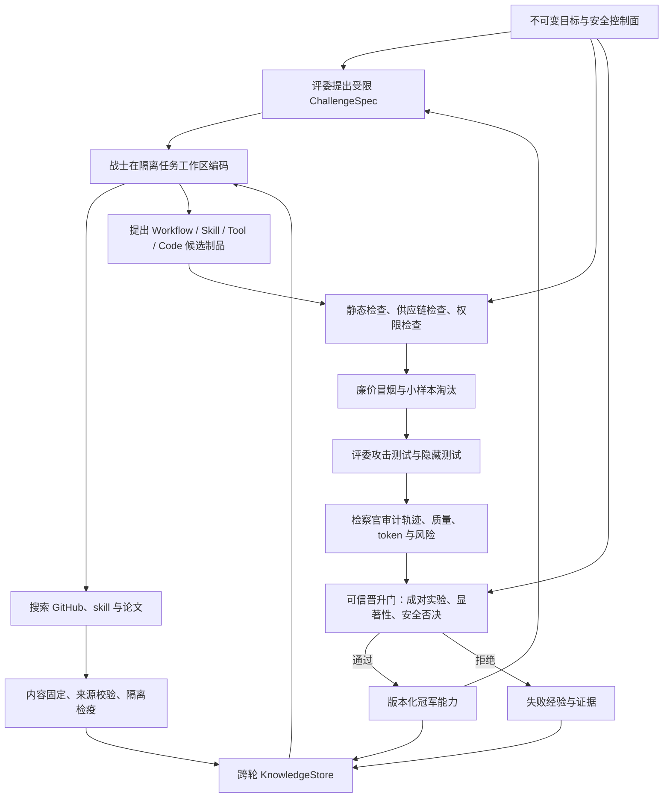

# AEGIS 自主进化架构与首启验收基线

## 1. 文档目的

本文给出“战士能够研究外部知识、改进工作流，并在安全评测后持续获得新能力”的完整目标闭环，同时明确当前代码实际做到的边界。本文中的“已实现”仅表示存在对应运行路径与测试；“部分实现”和“未实现”不得作为充分自主进化已经完成的依据。

当前结论：AEGIS 已具备**任务内自主编码、受限网络研究、GitHub exact-commit 文本快照与多文件 Skill bundle、DOI/arXiv 纯文本或 PDF 引用、跨轮研究制品召回、有来源代码进化请求、声明式 skill 自动静态验证与成对晋升、显式工作流提案、代码进化候选与自动成对晋升评测**。声明式 Skill v1 不注册动态动作、不执行脚本、不安装依赖；它只以沙箱内只读内容影响工作流。系统是否适合正式运行仍必须以最新版 `autonomy-preflight` 的实时结果为准。

## 2. 完整目标闭环

完整闭环必须区分两类对象：

- **不可变安全控制面**：权限、凭据、预算、隐藏测试、评分规则、沙箱策略、生命周期和晋升规则。角色只能观察其授权视图，不能直接修改。
- **可演化能力面**：工作流、研究模板、工具选择规则、停止条件、验证清单、经固定版本的声明式 skill，以及 `src/aegis/evolvable/` 下由固定纯 JSON Workflow ABI `workflow.py` 驱动的多文件能力层。生产代码进化不得写入其他仓库代码；任何能力只能先成为候选，经过检查和对照实验后再晋升，并保留回滚点。

“模型写了一段建议”不等于“能力已经进化”；只有候选制品在相同任务与种子下优于当前冠军、没有安全违规、完成持久化晋升，且下一轮确实加载该冠军，才构成闭环。

## 3. 当前已实现能力

| 能力 | 当前实现 | 主要源码 | 主要测试 |
|---|---|---|---|
| 任务内读写、执行和测试 | 战士可在容器工作区读写与执行；评委不可写；检察官只读 | `src/aegis/agent_runtime.py`、`src/aegis/sandbox/` | `tests/test_agent_runtime.py`、`tests/test_sandbox_agent.py`、`tests/test_owned_sandbox.py` |
| 安全网页研究 | 角色可搜索并抓取公开 HTTPS 内容；URL、重定向、DNS/peer 和大小受限；本地 SearxNG 只有窄化 loopback 例外 | `src/aegis/research/broker.py`、`http.py`、`url_security.py`、`searxng.py` | `tests/test_research_security.py`、`test_research_http.py`、`test_research_searxng.py` |
| 跨轮知识检索 | `KnowledgeStore` 使用不可变、按 SHA-256 寻址的 SQLite 记录；支持角色范围和文本检索 | `src/aegis/knowledge.py`、`src/aegis/cli.py` | `tests/test_knowledge.py` |
| 有来源的知识写入 | `knowledge.remember` 只接受本角色当前运行中经 `research.fetch` 得到的摘要标识；普通角色只能写给自身，检察官可授权跨角色可见 | `src/aegis/agent_runtime.py` | `tests/test_agent_runtime.py` |
| 显式工作流提案 | 模型必须调用 `strategy.propose`；完整 schema 包括阶段计划、研究查询模板、工具规则、停止条件、验证清单、skill 引用和 `max_steps` | `src/aegis/agent_runtime.py`、`src/aegis/strategy.py` | `tests/test_agent_runtime.py`、`tests/test_strategy.py` |
| 旧策略事件兼容 | 新 `WorkflowArtifact` 与旧 `StrategyContent` 均可回放；旧内容继续使用原始四字段序列化参与哈希 | `src/aegis/strategy.py` | `tests/test_strategy.py`、`tests/test_promotion_runtime.py` |
| 候选隔离和晋升 | 提案先成为候选；采用固定 12 个任务、每任务 2 个种子的冠军/候选成对实验；安全违规可否决；支持回滚 | `src/aegis/strategy.py`、`src/aegis/evaluation/promotion.py`、`src/aegis/promotion_runtime.py` | `tests/test_strategy.py`、`tests/test_evaluation_promotion.py`、`tests/test_promotion_runtime.py` |
| 事件溯源与用量核算 | campaign、角色阶段、模型用量、策略版本和晋升结果进入事件存储，可重放和报告 | `src/aegis/event_store.py`、`src/aegis/orchestrator.py`、`src/aegis/reporting.py` | `tests/test_event_store.py`、`tests/test_orchestrator.py`、`tests/test_reporting.py` |
| 可控启停 | 支持 start、pause、resume、stop、kill；沙箱归属和崩溃恢复有显式状态 | `src/aegis/cli.py`、`src/aegis/state_machine.py`、`src/aegis/orchestrator.py` | `tests/test_cli.py`、`tests/test_state_machine.py`、`tests/test_orchestrator.py` |
| GitHub/论文/skill 候选描述校验 | 已有无副作用 manifest 校验器：GitHub 必须固定 commit 和文件哈希，论文要求 DOI/arXiv 及页/段来源，skill 要求固定版本、依赖哈希和权限白名单 | `src/aegis/research/imports.py` | `tests/test_research_imports.py` |
| 研究导入候选动作 | 三个角色均可用 `research.import` 将**本角色当前运行中已抓取**的字节与严格 manifest 绑定；结果明确为 `execution_granted: false`，不会安装或执行候选 | `src/aegis/agent_runtime.py`、`src/aegis/research/runtime_imports.py` | `tests/test_agent_runtime.py`、`tests/test_research_runtime_imports.py` |
| 有界挑战提案 | 只有评委可调用 `challenge.propose`；可信侧从密封任务投影 `SealedTaskMetadata`，按枚举失败类别、确定性种子、难度和成本上限生成 `ChallengeSpec`，输出明确为 `declarative_only: true` | `src/aegis/challenges.py`、`src/aegis/agent_runtime.py`、`src/aegis/orchestrator.py` | `tests/test_challenges.py`、`tests/test_agent_runtime.py` |
| 冠军工作流普通轮次加载 | 普通 role phase 把冠军工作流作为 advisory guidance 注入目标，并用冠军 `max_steps` 收窄 campaign 上限；晋升实验使用相同收窄规则 | `src/aegis/strategy.py`、`src/aegis/orchestrator.py` | `tests/test_strategy.py`、`tests/test_orchestrator.py` |
| 检察官脱敏审计证据 | 检察官收到 Warrior/Judge 的 summary、submission、工具观察、token 和核验状态；私有推理被删除，原始 `stdout`、`stderr`、`content_base64` 被长度与 SHA-256 摘要替代 | `src/aegis/orchestrator.py`、`src/aegis/agent_runtime.py` | `tests/test_orchestrator.py`、`tests/test_agent_runtime.py` |
| GitHub exact-commit 采集与只读检查 | `github.resolve` 将搜索得到的 HEAD/branch/tag 安全解析为 40 位 commit；`github.collect` 再经 broker 查询 commit/tree/license API，拒绝 commit 漂移和截断树，逐个校验允许文本文件的路径、大小、Git blob SHA 与 provenance；`github.file_read` 只能读取本次 role run 快照已列出的文件 | `src/aegis/research/github_collector.py`、`src/aegis/agent_runtime.py` | `tests/test_github_collector.py`、`tests/test_agent_runtime.py` |
| GitHub Skill bundle 转换 | Warrior 可用 `github.skill_bundle` 把当前或跨轮 recall 的 exact-commit 子树确定性转换为声明式候选；根目录必须含精确 `SKILL.md`，只吸收 Markdown/RST/TXT/JSON/TOML/YAML，逐文件复核 SHA-256、Git blob SHA 与 raw provenance，固定空权限/空依赖并进入既有静态验证及 12×2 自动晋升队列 | `src/aegis/research/github_skill_bundle.py`、`src/aegis/agent_runtime.py` | `tests/test_github_skill_bundle.py`、`tests/test_agent_runtime.py` |
| DOI/arXiv 论文采集与引用 | `paper.collect` 校验 exact identifier、可信元数据和正文 provenance；支持 UTF-8 `text/plain` 与经 `SandboxPDFExtractor` 验证的逐页 PDF 文本；`paper.excerpt_read` 只能按已生成页/段 locator 读取带 SHA-256 的片段 | `src/aegis/research/paper_collector.py`、`src/aegis/research/pdf_extractor.py`、`src/aegis/agent_runtime.py` | `tests/test_paper_collector.py`、`tests/test_pdf_extractor.py`、`tests/test_agent_runtime.py` |
| skill 不可变候选与冠军 staging | skill 类型 `research.import` 在 registry 可用时自动注册不可变候选；晋升必须由外部提供同时通过的 safety/quality 双证据；只有 champion 能被 `skill.list` 列出并由 `skill.stage` 以内容寻址归档放入当前 sandbox，宿主不执行 | `src/aegis/skill_registry.py`、`src/aegis/agent_runtime.py`、`src/aegis/cli.py` | `tests/test_skill_registry.py`、`tests/test_agent_runtime.py` |
| 自身代码候选核心 | `EvolutionWorkspace` 默认只允许修改 `src/aegis/evolvable/` 的多文件能力层，并要求候选实际修改固定 canary ABI 入口 `workflow.py`；其他仓库代码保持只读，inert-only 或无变化导出不能形成候选。`EvolutionValidator` 在一次性隔离 sandbox 中执行有界验证；`EvolutionRegistry` 以哈希链持久化候选、外部证据晋升、撤销和回滚 | `src/aegis/evolution_workspace.py`、`src/aegis/evolution_validation.py`、`src/aegis/evolution_registry.py` | `tests/test_evolution_workspace.py`、`tests/test_evolution_validation.py`、`tests/test_evolution_registry.py` |
| 跨轮 campaign 知识复用 | 同一 CampaignController 的后续轮次可通过 `knowledge.search` 召回前一轮经核验写入的知识，不必重复外部研究 | `src/aegis/knowledge.py`、`src/aegis/agent_runtime.py`、`src/aegis/orchestrator.py` | `tests/test_knowledge.py`、`tests/test_orchestrator.py` |
| 跨轮研究制品索引 | GitHub exact-commit 允许文本、论文原文与可引用片段、声明式 Skill 内容均作为不可变 SQLite 快照持久化；可用 collector 校验的内容 SHA-256 精确召回并按 locator 读取，绝不执行 | `src/aegis/knowledge.py`、`src/aegis/agent_runtime.py` | `tests/test_knowledge.py`、`tests/test_agent_runtime.py` |
| 有来源的代码进化请求 | `evolution.request.source_refs` 只接受已归档制品的精确 artifact/locator；运行时绑定 kind、快照哈希和 blob 哈希形成紧凑引用，候选轮可再次按哈希召回原文 | `src/aegis/agent_runtime.py` | `tests/test_agent_runtime.py` |

## 4. 有意保留的安全边界与证据限制

### 4.1 GitHub 项目研究：exact-commit 文本采集与跨轮索引已接入，第三方构建仍禁止

当前角色先调用 `github.resolve(repository_url, ref)`，把搜索结果中的 HEAD、branch 或 tag 通过 GitHub API provenance 安全解析为规范仓库和 40 位 exact commit，再调用 `github.collect(repository_url, commit_sha)`。collector 只通过注入的 broker 获取 GitHub commit、recursive tree、license 和逐文件 raw 响应，要求非截断树、可用 SPDX、允许的文本路径、逐文件 tree size/Git blob SHA 和完整 provenance。采集结果自动进入不可变研究索引；后续 role run 可用 `research.recall(snapshot_sha256)` 精确召回并继续通过 `github.file_read` 或 `research.artifact_read` 读取已列出 locator。全过程没有 clone、执行或宿主写入。

对于声明式 AI Skill，Warrior 现在可在收集后或后续轮次 `research.recall` 后调用 `github.skill_bundle(artifact_id, root, name, version)`。转换器按路径排序形成稳定 bundle identity，将 `SKILL.md` 与白名单参考文本合成为单一不可执行候选，同时把原始多文件按内容哈希归档并保留 repository、exact commit、Git blob SHA、SHA-256 与逐响应 provenance。脚本、源码、二进制、依赖声明和动态权限不会进入 bundle；转换不执行插件、不安装依赖、不注册新工具或权限。静态通过只产生 `validated_pending`，真正 champion 仍需既有 smoke 与 12 任务×2 seed 成对评测后 CAS 晋升。

系统有意禁止直接构建、执行第三方代码项目，以及把任意可执行多文件实现直接合并进 AEGIS。战士可把归档文件作为 `evolution.request.source_refs` 的有来源输入，由网络隔离的 AEGIS 候选轮自行实现等价改进，再经过验证和成对晋升。该限制是宿主安全不变量，不是通过开放第三方执行权限来补齐的功能缺口。

### 4.2 论文研究：exact DOI/arXiv、PDF 提取与跨轮引用已接入

当前 `paper.collect` 通过 broker 获取 exact DOI/arXiv 元数据与正文，拒绝 identifier 漂移、恶意元数据、来源/摘要/大小异常和乱码；对 `text/plain` 按 form-feed 页或空行段落生成 locator 与片段 SHA-256，`paper.excerpt_read` 只能读取快照内已列出的引用。原文和引用片段会进入不可变跨轮索引，可按正文 SHA-256 精确召回；快照与 `ResearchImportArtifact` 均不可执行并保留 metadata/content provenance。

生产控制器会注入 `SandboxPDFExtractor`，在一次性 `network=none` 容器中提取逐页文本，并把源 PDF 大小和 SHA-256 与结果绑定；缺少该验证解析器时仍然 fail closed。系统没有把公式/图表结构化或自动复现整篇论文，但战士已能读取纯文本或 PDF 页级引用、跨轮召回，并把精确来源绑定到代码进化候选。这些增强可继续作为研究质量优化，而不是自主进化闭环的权限前提。

### 4.3 AI skill：声明式 Skill v1 自动验证、评测、晋升与复用

`research.import` 对 skill manifest 与当前抓取字节完成绑定后，会自动注册候选并运行可信静态验证。Skill v1 只接受严格 UTF-8 声明文本；非空依赖、控制字符、shebang、显式 executable/installer 入口、越权权限或身份哈希不一致都会失败关闭。`github.skill_bundle` 还可从当前或跨轮召回的 exact-commit GitHub 子树确定性转换多文件声明式 bundle，并保留逐文件 Git blob、SHA-256 与 provenance。

通过静态验证的候选进入 `VALIDATED_PENDING`。自动 scheduler 锁定同名 champion（没有 champion 时锁定 `NO_SKILL`）及 champion revision，先运行 2-task smoke，再复用 smoke 结果完成严格 12 task × 2 seed 成对评测。arm 级结果可从 EventStore 恢复，token 必须来自 verified gateway usage，安全或质量门禁失败即拒绝；成功后只凭 registry 内不可变 static/evaluation/funnel report 执行 CAS 晋升。下一轮 `skill.list` 可见 champion，`skill.stage` 将只读文本放到 `.aegis/skills/<name>/active/SKILL.md`。宿主从不执行内容，也不安装依赖。

### 4.4 自我编程：候选工作区、验证和自动晋升闭环已接入

`EvolutionWorkspace` 会建立完整公开仓库上下文的确定性副本，同时排除 `.git`、虚拟环境、缓存、本机 local config，以及 taskpack 的 `hidden`、`reference`、`defect`、`mutants` 和 `*.validation.json` held-out 资产。公开 `prompt.md`、`public/` 与 manifest 仍可读。WSL/Podman 将副本根目录以只读方式挂载，生产默认只对 `src/aegis/evolvable/` 多文件能力层叠加可写 bind mount；候选因此能新增受限 helper 并让 `workflow.py` 组合它们，却无法修改其他仓库代码。冻结导出后会逐字节拒绝只读文件变化、路径穿越、symlink、超限和未声明变更，并要求固定入口实际新增或修改；只改 inert helper 或原样导出均不能形成候选。`EvolutionValidator` 可在隔离且网络关闭的 disposable sandbox 中按 argv 运行验证，绑定基线/候选 receipt、命令证据和输出摘要。`EvolutionRegistry` 可不可变注册候选，以哈希链记录外部完整证据晋升、supersede、revoke 和 rollback，并只输出版本化 sandbox archive。

`CampaignController` 现在接受 Warrior 的显式 `evolution.request`，在一次性网络隔离工作区中创建候选。collection 后归档、父冠军 lineage、baseline 与 `request_id -> artifact_id` 不可变来源映射在 `EvolutionRegistry` 的同一个事务中提交，并与 registry 哈希链事件对账；即使进程在 campaign 事件落盘前崩溃，重放也会恢复同一候选而不会再次调用模型生成。随后才执行验证并持久化证据。验证 sandbox 会重新应用“仓库根只读、仅 evolvable paths 可写”的挂载策略，防止候选在测试期间篡改测试或控制面来自证；canary 以全只读 workspace 运行固定入口。通过验证的候选由 `EvolutionPromotionScheduler` 先运行固定前两个任务的 seed 0 冒烟，再补齐完全相同的 12 任务×2 seed 成对实验；每个 arm、paired observation 和 funnel report 都进入 campaign 事件流，预算中断后只补缺失项。通过漏斗后采用父冠军和 promotion version 的 CAS 晋升。候选代码和冠军代码只通过 network-none canary 生成严格 `WorkflowArtifact` advisory，不导入宿主，也不写回宿主仓库。

下一候选从当前冠军 archive 派生；无冠军时才使用宿主 bootstrap snapshot。当前仍需在真实 WSL/Podman 中验证长时间配对实验；collection registry 提交与 campaign 事件提交之间的崩溃窗口已由不可变 request-origin 映射和确定性恢复关闭。

生产控制面不会接受“直接 submit”来绕过关键自主动作：三个角色每轮至少执行一次知识检索或外部搜索，Warrior 每轮都必须提出真实的 `evolution.request`，而非以工作流提案替代；每个正式候选均须绑定并逐项召回、读取 GitHub 与论文证据，随后才可读写候选工作区。候选必须实际执行 `workspace.write`。每轮结束后，控制面把密封质量证据与脱敏 Judge/Prosecutor 结论固化为 `round_feedback_recorded`，下一轮 Warrior 必须为每项反馈提交结构化 `adopt`、`defer` 或 `reject` 决定。候选晋升预算不足时 campaign 会暂停并保留已完成的成对观察，恢复后仅补齐缺项。专用 `autonomous_evolution_v1` 验收进一步强制第一轮完成 GitHub exact-commit 收集、文件读取、声明式 Skill bundle 静态验证、知识持久化与结构化工作流提案；Warrior 随后按固定顺序检索 exact DOI/arXiv、收集并读取论文摘录、召回 GitHub 来源、读取并修改任务工作区、在沙箱中验证，再提交同时绑定 GitHub 与论文 `source_refs` 的 `evolution.request`。`autonomous_evolution_v2` 在此基础上还验证首轮反馈事件精确绑定三类证据，并验证二轮 Warrior 对每项反馈完成处置。候选运行时同样先读取 `src/aegis/evolvable/workflow.py`，并保留 `build_workflow`、`main` 与模块 CLI ABI 后才可写入和验证。这些动作门由控制器跟踪实际成功动作，而不是依赖提示词自觉。

### 4.5 独立真实 smoke 验收

`configs/autonomy-smoke.example.json` 使用两轮、12 taskpack、1400 万 token、800 request 和 8 小时 wall-time 上限。该容量覆盖当前最短完整证据链的 221 个逻辑调用及每次最多 3 次 relay attempt，并为每次调用预留 16384 bytes prompt 与配置的最大输出；acceptance 同时固定至少 20 steps、4096 output tokens。它不是任意更长历史上下文下的绝对最坏上界；运行时会对超出该 prompt bound 的请求 fail-closed。验收 campaign 必须通过 CLI 全局 `--data-dir` 创建在独立目录中；否则创建失败，以免污染正式 campaign 的事件、知识、Skill 与冠军注册表。第一代完成 12×2 成对晋升后，第二代普通 research/warrior 阶段必须实际消费冠军 canary advisory，并从冠军 archive 派生后继候选；控制器观察到继承即持久化事件并自动暂停。`aegis --data-dir <isolated> autonomy-smoke-verify <campaign-id>` 只有在 GitHub、Skill、知识、策略、论文、双来源代码候选、验证、24 个配对观察、verified usage、晋升、canary 和父冠军继承全部成立且无 campaign/cleanup 错误时才通过。

专用 800-request smoke 只对代码进化候选执行 12×2 晋升，以保证在容量内到达第二代继承。真实 Skill 候选停在 `validated_pending`，Strategy 停在持久化 pending；控制器记录 `autonomy_acceptance_auxiliary_promotions_deferred`。普通 campaign 不采用该延期，仍运行两类自动晋升；其静态验证、2-task smoke、12×2 调度和 CAS 门由独立组件与本地验收测试覆盖。因此该 smoke 不能单独作为 Skill/Strategy 已完成真实长时晋升的证据。

### 4.6 工作流晋升：普通轮次已加载，细粒度效果归因仍不完整

当前候选能够携带完整 `WorkflowArtifact` 并进入策略实验。普通 role phase 已调用 `resolve_guidance` 注入冠军内容，并使用冠军 `max_steps` 收窄 campaign 步数上限；晋升实验也采用相同的上限收窄规则。

`tests/test_orchestrator.py` 中的 `test_promoted_workflow_max_steps_applies_to_normal_role_phase` 已证明晋升后的 `max_steps` 在普通轮次实际生效。其余文本字段以 advisory JSON 进入提示，但仍缺少逐字段消融或因果测试，不能据此宣称每个字段都提高了工程表现。

### 4.7 评委自主出题：已有受限 ChallengeSpec，没有可信任务构建器

评委当前可以调用 `challenge.propose`。可信侧只向它提供由任务 manifest 投影的 `SealedTaskMetadata`，不提供隐藏测试内容；失败类别必须来自枚举，生成结果受数量、难度、成本和确定性种子约束，并明确是 declarative `ChallengeSpec`。

当前仍没有可信任务构建器把 `ChallengeSpec` 变成候选实现、参考解、公开测试和隐藏测试，也没有对生成任务执行变异充分性及防泄漏审核。`src/aegis/challenges.py`、`src/aegis/agent_runtime.py`、`tests/test_challenges.py` 和 `tests/test_agent_runtime.py` 证明的是“评委能提出安全有界的挑战声明”，不是“挑战已经成为可执行新任务”。

### 4.8 检察官宏观优化：有事件和用量，但缺少完整能力归因

当前检察官已收到 Warrior/Judge 的有界证据、锁定质量和 token 汇总。证据保留动作与摘要，但删除私有推理；原始 `stdout`、`stderr` 和 `content_base64` 只保留长度与 SHA-256，从而避免把大块或敏感原文继续传播。对应实现和边界测试位于 `src/aegis/orchestrator.py` 与 `tests/test_orchestrator.py`。

系统尚无专门的因果归因制品，把“研究来源—工具动作—代码变化—测试结果—token 成本—失败原因”关联成可查询图谱；也没有对战士与评委能力分别生成、实验和晋升的长期课程调度器。脱敏证据可支持审计，但不等于已经完成因果归因。

### 4.9 分层晋升漏斗：静态验证、冒烟和完整成对实验已接通

当前漏斗依赖严格 schema、网络隔离验证、2 对冒烟和完整 12×2 成对晋升实验。冒烟观察会复用于完整设计，只能提前淘汰安全违规、不可核验用量或明显退化候选，不能直接晋升。后续仍可加入供应链专项检查、小样本顺序检验和跨请求重复候选去重，但这些前置门同样不得绕过完整晋升门。

### 4.10 v2 动态任务冷启动与受信 Git checkpoint 连接器

v2 设计禁止固定任务包课程（`autonomy_v2.dynamic_only` 强制为 true，`task_pack_paths` 必须为空），因此任务库需要一个不破坏“评委自主出题”语义的起点，同时战士需要在不动主机的前提下把自身代码状态存档到公开仓库。

**冷启动锚点**：`GenesisSeeder` 只在任务库完全为空时把仓库内 12 个内置 taskpack 以内容寻址方式经同一个 `TaskForge` 验证边界注册为 `FIXED_ANCHOR`，逐包执行参考解/缺陷/变异充分性验证后才入库。`DynamicTaskRegistry.select_dynamic_cohort` 只在不存在任何合格动态任务时回退到锚点（tier=HALL_OF_FAME）；一旦评委锻造的动态任务通过 holdout 可被选中，锚点立即退出竞争。这样首轮循环有可信、可运行的训练集，而固定任务永远不会成为长期课程主体。`aegis evolution-cycle <campaign> [--dry-run] [--no-seed-anchors] [--cohort-limit N]` 提供 dry-run（只读汇报）与真实冷启动（沙箱验证后入库）两条路径。

**受信外部连接器**：`src/aegis/connectors/` 提供插件 ABI 的 EXTERNAL 动作 `aegis.git_checkpoint`。角色（当前仅战士）经 `ToolBroker` 的 grant/request/receipt 全链提交 checkpoint；`SqliteConnectorJournal` 先记 intent 再执行、按 request_id 幂等重放、冲突即拒绝；`GitCheckpointConnector` 在控制面内把请求参数重新校验为 `GitCheckpointRequest`，再交给 `GitPublisher` 在隔离 clone 中提交并 CAS 推到 `refs/heads/candidate/warrior/<generation>`，逐文件执行路径授权、秘密内容扫描、exact-base 与 create-only 校验，远端凭据始终留在发布者环境，角色不可见。插件 manifest 内容寻址、只授权 Warrior、effect=EXTERNAL 且必须携带 operation_id；未配置连接器/日志时 grant 阶段即 fail closed。对应边界测试覆盖 intent-first 日志、幂等重放、冲突拒绝、越权路径拒绝、candidate ref 不可重写。

**模型驱动全循环**：`aegis evolution-cycle <campaign> --run` 现已把 `EvolutionCycleController` 的三个模型角色（战士解题、评委评审/出题、检察官审计）与三方协商（独立反思+集体裁决）通过 `RoleAgentRuntime` 接成可真实调用路径。每个模型回合仍然走既有边界：JSON 动作约束、token 计量、沙箱执行、评委/检察官脱敏上下文。质量锁定、锻造任务验证/入库、归因汇总、角色候选资格与激活集提交均为控制面确定性步骤；`RoleAgentRuntime` 可在配置 `public_repo_url` 时注入 checkpoint 插件，让战士经 journaled connector 自主存档候选 ref。`evolution-cycle` 先冷启动（必要时）再执行一个完整 cycle，状态与证据全部落入同一 EventStore，`status/report/replay` 可见。

**角色试用进化与归因账本**：检察官可在审计提交中提出角色候选（`role_candidates`）。控制面在归因门未被安全/完整性/用量否决时，把候选经 RoleRegistry 的 collect→validate→qualify 链登记并提交为试用（probation）激活集；下一 cycle 的快照与评测立即使用新角色版本。每个 cycle 会把真实 `EvaluationArm`（角色版本向量、质量分、token 成本、usage/safety/integrity 标志）追加到 `data_dir/attribution_arms.jsonl` 账本；尚无同一 cohort 配对数据时，归因报告如实给出 INVALID_DESIGN/CONFOUNDED 判定，而不是伪造因果结论。

**失败修复链路**：`aegis evolution-cycle <campaign> --run --repair` 在 cycle 抛错时自动进入修复：检察官模型生成有界补丁 → 经 journaled Git connector（或测试用确定性发布器）发布隔离候选 ref → 控制面校验路径授权与秘密扫描 → 验证通过后在 RoleRegistry 中把修复后的角色版本以 CAS 方式提交为新的试用激活集，整个过程按 intent-first 事件写入同一 EventStore，崩溃后可重放续跑。`CycleRepairValidator` 只放行 warrior 授权路径内、无秘密内容、内容寻址证据完整的补丁。

当前边界：评委“直接产出可执行 task-pack 归档”仍依赖模型输出 base64 tar（或先走声明式 proposal，由可信构建器后续物化）；跨 cycle 角色对比目前被归因模型判为 confounded，完整因果归因需要同 cohort 的冠军/候选配对实验。这两项是明确的后续实现项，不再属于“CLI 全循环缺失”。

### 4.11 真实两代 smoke 验收记录（2026-08-10）

在真实 WSL/Podman + 真实模型网关上完成两代 v2 循环验收：`autonomy-preflight` 22 项全绿（沙箱 doctor、网关实时探针、研究搜索/抓取、evolution 工作区 network-none 验证、主机完整性、清理）；`evolution-cycle <campaign> --run --repair` 连续两代均以 `completed` 收尾，每代产出 submission、judge-review、quality-lock、prosecutor-audit、council、task-forge、task-validation、attribution、qualification、activation 十类内容寻址证据。冷启动在真实沙箱中完成 12 个锚点的变异充分性验证；第一代归因如实判定 `invalid-design`（无基线臂），第二代在账本存在后如实判定 `confounded`；`attribution_arms.jsonl` 记录两臂（quality 0.55/0.0，角色版本向量一致）。

运行中暴露并已修复的三类真实问题：① preflight 的 v1 形状检查与 v2 动态设计冲突 → 新增 v2 分支（v2 预算门槛、锚点/接线门禁）；② cycle 沙箱直接操作未走 doctor 前置且未 prepare 生命周期 → 补齐 doctor 前置与每角色回合 prepare/destroy（含随机沙箱 id 与冲突重试）；③ FAILED/中断态无法续跑 → 状态机新增 `retry`（FAILED→CREATED），快照同代幂等，`evolution-cycle` 对中断态自动 stop→fail→retry。真实运行还验证了失败修复链：一次 cycle 失败被记录为 `cycle_failed_recovery_started` 并以 `rolled-back` 收尾；后续代继续推进。验证数据位于 `C:\Users\XKZ\Documents\VSCode Projects\AEGIS\.smoke-data-v3`（配置 `configs/evolution-smoke.example.json`）。

## 5. 信任边界

| 区域 | 信任级别 | 允许行为 | 禁止行为/必要约束 |
|---|---|---|---|
| Windows 主控、事件库、预算器、晋升器 | 可信控制面 | 验证配置、记账、调度、裁决、启停和回滚 | 不把角色文本当命令；不向模型暴露密钥和隐藏测试 |
| 专用 WSL2 与 rootless Podman 管理层 | 受控执行面 | 创建和销毁有资源上限的任务容器 | 不授予 sudo、宿主挂载、Docker/Podman 管理 socket 或 WSL interop |
| 战士任务容器 | 不可信 | 修改一次性任务副本、运行允许的命令 | 默认 `network=none`；不得接触 AEGIS 控制面、宿主目录、凭据和隐藏测试 |
| 评委审查容器 | 不可信、独立于战士 | 读取公开提交、运行公开/授权测试、提出建议 | 不复用战士私有工作区；不得读取战士私有推理或写入提交 |
| 检察官模型 | 不可信、只读角色 | 阅读脱敏事件和评分，提出策略或治理建议 | 不执行命令、不修改工作区、不直接作出晋升状态变更 |
| 搜索结果、网页、GitHub、论文、skill | 敌对输入 | 作为带来源的数据获取、校验和检疫 | 永不作为系统指令；不得直接安装或执行；必须固定版本和哈希 |
| KnowledgeStore | 持久但不可信知识 | 保存不可变来源、摘要、标签和实验结果；按角色检索 | 内容仍按不可信建议处理；SHA-256 证明同一字节，不证明内容正确或安全 |
| 候选策略/未来候选代码与 skill | 不可信候选能力 | 接受静态检查、沙箱试验和成对评测 | 未晋升不得进入冠军路径；不得携带控制面字段；必须可回滚 |

关键不变量：

1. 模型永远不能通过提案修改权限、预算、凭据、隐藏测试、评分、沙箱或晋升门。
2. 外部内容进入长期存储或候选执行前，必须有最终 URL、内容哈希、大小、媒体类型和固定版本信息。
3. 研究容器与任务执行容器分离；任务容器继续保持无网络。
4. 候选与冠军使用相同任务、种子、资源上限和评分路径；隐藏测试对二者均不可见。
5. 任何安全违规直接阻止晋升；已晋升版本保留可审计事件和可用回滚点。
6. token、请求失败和重试都必须记账，不能只统计成功响应。

## 6. 正式启动验收矩阵

“正式启动”分为两个口径：

- **受限策略演化试运行**：仅使用当前任务内编码、网页研究、不可执行 `research.import` 候选、KnowledgeStore、WorkflowArtifact 和 declarative ChallengeSpec。
- **充分自主进化正式运行**：战士可以研究网页、GitHub、声明式 Skill 和论文，把来源绑定到隔离代码候选，自动验证、成对评测、晋升、继承和回滚；全部实时门禁必须在当前机器通过。第三方代码直接执行、动态扩权和宿主写回始终不属于该口径。

| 验收项 | 权威证据 | 受限试运行门槛 | 充分自主进化门槛 | 当前判定 |
|---|---|---:|---:|---|
| WSL/Podman 隔离 | `aegis doctor`；`tests/test_sandbox_wsl.py`、`test_sandbox_agent.py`、`test_sealed_evaluation.py` | 必须通过 | 必须通过 | **真实 doctor 已通过；每次首启仍实时复验** |
| 生命周期可控和崩溃恢复 | `tests/test_orchestrator.py`、`tests/test_state_machine.py`、真实 pause/resume/kill 冒烟 | 必须通过 | 必须通过 | 已实现，须做真实冒烟 |
| API 与 token 记账 | 最小模型探针；`tests/test_gateway_client.py`、`test_budget.py`、`test_orchestrator.py` | 必须通过 | 必须通过 | **preflight 已接入真实模型与 verified usage 探针；模型请求默认超时 900 秒，仅由 `AEGIS_OPENAI_TIMEOUT_SECONDS` 显式覆盖** |
| 安全研究链路 | SearxNG 搜索与公开 HTTPS fetch 冒烟；研究安全测试 | 必须通过 | 必须通过 | **preflight 已接入真实搜索与固定 HTTPS 抓取探针** |
| 跨轮知识持久化 | 两个独立 role run 的 remember/search、数据库重开，以及两轮 CampaignController 召回测试 | 必须通过 | 必须通过 | **已实现，已有跨轮 campaign E2E 测试** |
| 显式 WorkflowArtifact 提案 | `tests/test_agent_runtime.py`、`tests/test_strategy.py` | 必须通过 | 必须通过 | 已实现 |
| 冠军/候选成对晋升与回滚 | 12任务×2种子、故意退化候选、安全违规候选、回滚测试 | 必须通过 | 必须通过 | 已实现组件与 orchestrator 测试 |
| 冠军工作流在普通轮次实际加载 | 晋升后普通轮次的 guidance 注入和 `max_steps` 行为断言 | 必须通过 | 必须通过 | **已实现；`max_steps` 有 orchestrator 测试，文本字段仍缺效果归因** |
| 研究导入候选绑定 | 当前 role run 的真实 fetch→import；来源/哈希不符拒绝；结果不可执行 | 必须通过 | 必须通过 | **已实现候选绑定；不等于安装或执行** |
| GitHub 固定提交采集 | commit/tree/license API、非截断证明、逐文件 size/blob SHA/provenance、只读文件白名单、跨轮哈希召回 | 建议通过 | 必须通过 | **已实现 collector、不可变跨轮索引与角色动作；第三方检疫构建仍禁止** |
| GitHub Skill bundle | exact commit、根 `SKILL.md`、白名单文本、逐文件 blob/hash/provenance、静态验证及自动晋升 | 建议通过 | 必须通过 | **已实现当前轮与跨轮转换；脚本、依赖和动态权限固定禁止** |
| 论文搜索、解析和引用 | exact DOI/arXiv、元数据漂移拒绝、text/plain 页/段哈希、隔离 PDF 页提取 | 建议通过 | 必须通过 | **已实现纯文本与 PDF collector、跨轮引用和候选来源绑定** |
| 声明式 Skill v1 闭环 | 不可变候选、静态证据、2-task smoke、12×2 paired、verified token、CAS 晋升、champion-only active-path staging | 建议通过 | 必须通过 | **已完成生产接线；以 preflight 和真实 taskpack 验收为准** |
| AEGIS 固定 Workflow ABI 候选闭环 | EvolutionWorkspace→持久 collection/validation→2 对 smoke→12×2 paired funnel→CAS promotion→network-none canary；候选必须实际修改 `src/aegis/evolvable/workflow.py`，并可协同改动该能力层内 helper | 可缺失 | 必须通过 | **生产链已接入；inert-only 和无变化候选已拒绝，须完成真实 WSL 长时验收** |
| AEGIS 只读完整上下文 | 候选可读完整仓库，但生产默认只能写 `src/aegis/evolvable/` 能力层；路径、symlink、只读逐字节完整性与归档边界测试 | 可缺失 | 必须通过 | **已实现并通过真实 WSL/Podman 探针：232 文件可读上下文、受保护写/删/chmod/hardlink 全部拒绝、能力层新增/修改成功、宿主哈希不变** |
| 隐藏评测资产隔离 | preflight、local acceptance 与真实仓库快照测试确认排除 `hidden/reference/defect/mutants/*.validation.json`，同时保留 prompt/public/manifest | 可缺失 | 必须通过 | **已接入 fail-closed 排除与回归测试；禁止候选读取 held-out 答案** |
| 本地候选长链验收 | `aegis autonomy-local-acceptance`：完整 pytest、验证期保护路径攻击、network-none canary、宿主哈希与清理 | 可缺失 | 必须通过 | **已实现；真实 WSL/Podman 验收通过，保护路径写入以 nonzero-exit 拒绝** |
| 评委有界 ChallengeSpec | Judge-only 权限、密封元数据、枚举失败类别、数量/难度/成本限制和确定性输出 | 建议通过 | 必须通过 | **已实现声明生成；尚不能构建真实任务/测试** |
| 检察官跨角色审计 | Warrior/Judge 有界证据与逐角色 token；私有推理和原始输出不得进入上下文 | 必须通过 | 必须通过 | **已实现脱敏证据；长期因果归因仍缺失** |
| 分层低成本晋升漏斗 | 隔离验证→2 对冒烟→完整12×2，验证前置门不能直接晋升 | 可缺失 | 必须通过 | **已实现并有独立 scheduler 恢复测试** |
| 全量回归 | `pytest`、`unittest`、Ruff、Mypy 全部通过，且 Linux 专属测试在 WSL 内通过 | 必须通过 | 必须通过 | 每次正式启动前重新执行 |

## 7. 首启决策规则

1. 如果目标是验证当前安全控制面和工作流提案机制，可在所有“受限试运行门槛”通过后启动小预算、少轮次 campaign，并在对外描述中明确称为“受限策略演化试运行”。
2. 充分自主进化必须通过同一份实时 `autonomy-preflight`，再按 4.5 节以独立 `--data-dir` 运行 `autonomous_evolution_v2` smoke，并由 `autonomy-smoke-verify` 证明“研究来源→候选→验证→成对评测→晋升→反馈回流→次代继承”的完整事件链。不得用单元测试替代该运行证据。
3. 首轮不得自动扩大外部写权限、开放任务容器网络或让模型直接修改主仓库。新增能力应落在隔离候选副本中，并继续经过可信晋升门。
4. 任一 doctor、沙箱逃逸、隐藏测试泄漏、用量不可核验、知识来源不完整或安全否决测试失败，都应阻止正式启动，而不是降级为警告。

## 8. 建议的后续实现顺序

1. 获得用户对固定低敏探针 payload 的授权后，运行最新版完整 `autonomy-preflight` 并归档结果；`autonomy-local-acceptance` 已独立通过。
2. 使用 `configs/autonomy-smoke.example.json` 和独立 `--data-dir` 验证研究来源、代码候选、canary、成对评测和冠军继承的真实长链恢复，并要求 `autonomy-smoke-verify` 通过。
3. 为 WorkflowArtifact 文本字段增加逐字段消融和效果归因，提升“为什么有效”的证据质量。
5. 评委可信任务构建器和检察官长期归因图谱属于三角色系统的后续增强，不得削弱战士现有安全边界。
