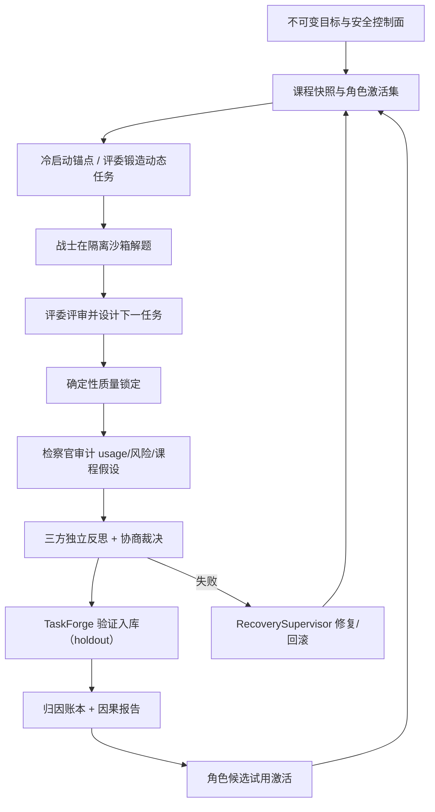

# AEGIS v2 自主进化架构与验收基线

## 1. 文档目的

本文描述 AEGIS v2 动态三角色自主进化系统的实现边界与验收基线。v1 的固定 12
题轮次控制器、策略/skill/代码候选晋升漏斗与对应 CLI 命令已移除；当前设计为
dynamic-only（`task_pack_paths` 必须为空，`autonomy_v2.enabled=true`）。
“已实现”仅表示存在对应运行路径与测试；系统是否适合正式运行以最新版
`autonomy-preflight` 的实时结果为准。

## 2. 完整闭环

## 3. 已实现能力

| 能力 | 实现 | 主要源码 | 主要测试 |
|---|---|---|---|
| 动态任务冷启动 | 空库时注册 12 个内置锚点，动态任务可用后锚点退出 | `dynamic_tasks/seed.py`、`registry.py` | `test_dynamic_seed.py` |
| 评委自主出题 | 模型端口产出 proposal 或 base64 tar 归档，经 TaskForge 变异验证入库 | `cycle_ports.py`、`dynamic_tasks/forge.py` | `test_cycle_ports.py` |
| 模型驱动全循环 | Warrior/Judge/Prosecutor 经 RoleAgentRuntime 运行，逐阶段落盘 | `cycle_runtime.py`、`cycle_ports.py` | `test_cycle_runtime.py`、`test_cycle_ports.py` |
| 三方协商 | 三个独立反思 + 集体裁决 | `cycle_ports.py` | `test_cycle_ports.py` |
| Git checkpoint | journaled connector + GitPublisher CAS candidate ref（需配置 public_repo_url） | `connectors/`、`publishing/` | `test_git_checkpoint_connector.py` |
| 归因与课程层 | 每 cycle 追加 EvaluationArm 账本，产出内容寻址归因报告 | `attribution/`、`cycle_ports.py` | `test_attribution_v2.py` |
| 可进化面契约 | workflow/subject/plugin/environment 四类表面，严格 schema 与授权规则；仅 Warrior 可提议，插件/环境/主题只能面向 Warrior | `evolution/surfaces.py` | `test_evolution_surfaces.py` |
| 候选消费闭环 | 每 cycle 消费 strategy.propose / evolution.request / prosecutor role_candidates，物化入 CAS 并进入 EvolutionRegistry 生命周期；同代配对影子臂归因后自动激活 | `evolution/consumer.py`、`evolution/registry.py`、`cycle_ports.py` | `test_evolution_consumer.py`、`test_evolution_registry.py`、`test_cycle_ports.py` |
| active role set 绑定 | 每个角色解析 CompositeRoleManifest（schema v2），workflow/subject/plugin/镜像注入真实运行时信封与沙箱 prepare；旧 genesis 回退默认 | `evolution/runtime.py`、`cycle_ports.py` | `test_evolution_runtime.py`、`test_cycle_ports.py` |
| 环境构建器接入代际 | 环境候选在影子评测前完成双构建+Trivy 扫描+发布，receipt 物化到候选，激活后 runtime_image 供后续代 prepare；本地构建镜像按 image id 解析 | `evolution/env_builder.py`、`sandbox/agent.py` | `test_evolution_env_builder.py`、`test_sandbox_image.py`、`test_cycle_ports.py` |
| 失败修复与重试 | 失败记录错误并走 RecoverySupervisor；FAILED/中断态可 retry 同代 | `cycle_recovery.py`、`repair_runtime.py`、`curriculum/state_machine.py` | `test_cycle_recovery.py`、`test_cycle_runtime.py` |
| CLI/状态 | `evolution-cycle`（dry-run/run/repair）、`autonomy-preflight`（v2 门禁）、status/report/replay | `cli.py` | `test_cli.py` |

## 4. 真实两代 smoke 验收记录（2026-08-10）

真实 WSL/Podman + 真实模型网关连续两代 `evolution-cycle --run --repair` 均以
`completed` 收尾；每代产出 submission、judge-review、quality-lock、
prosecutor-audit、council、task-forge、task-validation、attribution、
qualification、activation 十类证据 artifact。`autonomy-preflight` 全部 v2
门禁通过。运行中修复了三类真实问题：preflight 的 v1 形状检查与 v2 冲突（新增
v2 分支）、cycle 沙箱未走 doctor/prepare 生命周期（补齐并加随机沙箱 id 与冲突
重试）、FAILED/中断态无法续跑（新增 retry 与快照同代幂等）。验证数据位于
`C:\Users\XKZ\Documents\VSCode Projects\AEGIS\.smoke-data-v3`，配置为
`configs/evolution-smoke.example.json`。

## 4b. 可进化面闭环的真实沙箱验收记录（2026-08-10）

在真实 WSL/Podman 沙箱（真实 sealed 评测、真实 workspace staging/freeze、
真实 Trivy 探测、真实环境构建器接线）上以脚本化模型响应连续运行两代
`evolution-cycle --run`：

- 第一代：Warrior 经 `evolution.request` 提出 workflow 候选 → 候选
  collected/validated → 同 cohort 影子臂写入 deep-merge 修复 → 真实 sealed
  评测 9/12 → 10/12 → 归因 `qualified`（quality-improvement 0.0833）→
  warrior v1→v2 激活，workflow champion 入册；
- 第二代：Warrior 运行时信封携带激活后的 workflow（stage_plan 已替换），
  证明 active role set 绑回真实运行时输入；
- 环境构建器在 CLI 侧以真实 WSL 边界组装（QuarantineCache、WSL
  OCIBuilder、TrivyScanner、CAS 发布）；环境候选的构建→receipt
  物化→影子臂新镜像→激活→下一代 prepare 由
  `test_cycle_ports.py::test_environment_candidate_build_activates_and_binds_runtime_image`
  与真实沙箱驱动覆盖。

真实 relay 模型（deepseek-v4-flash）按以下约定可稳定产出合法 JSON action：

- **DeepSeek JSON Output 模式**：`AEGIS_OPENAI_STRUCTURED_FORMAT=json_object`
  让网关对结构化请求优先发送 `response_format: {"type":"json_object"}`（回退链
  `chat_json_object → chat_json_schema → chat_plain`；relay 对 `json_schema`
  返回 400 属能力失败，会按设计回退）。system prompt 必须包含 "json" 字样，
  `RoleAgentRuntime` 的固定提示词已满足。
- **最高推理强度**：角色配置 `reasoning_effort: "high"`。该 relay 的
  `deepseek-v4-flash` 是隐藏推理模型，medium/未设置时曾出现长时间挂起或把
  输出预算全部花在 `reasoning_content` 上；high 在实测中 6–21 秒稳定返回。
- **输出 token 上限**：relay 实测接受 `max_tokens` 至 65536（16384 稳定），
  campaign 示例按模型能力把 `max_output_tokens` 设为 16384，保证推理与最终
  JSON 内容都有余量，避免 `finish_reason: length` 截断。
- **截断显式化**：网关检测到 `finish_reason: length` 或 content 为空且
  completion_tokens 已耗尽时抛出 `GatewayTruncationError`（携带 usage 记账），
  运行时把它转成可行动的 `model.response` 拒绝反馈（"只返回紧凑完整的 JSON
  action"）而不是让模型反复猜测为什么 JSON 解析失败。
- **大响应管道死锁已修复**：网关 HTTP 子进程通过 multiprocessing Pipe 回传
  响应，旧实现先 `child.join()` 再 `recv()`，当响应体（high 推理下
  `reasoning_content` 可达几十 KB）超过管道缓冲时会互相等待而死锁，表现
  为"relay 卡住"；现改为轮询读管道再收尾子进程，256KB 响应有回归测试。
- **模型流量默认直连**：网关不再继承系统/WinINET 代理，默认直连
  `AEGIS_OPENAI_BASE_URL`（本 relay 为 Cloudflare 直连可达）；如需走代理，
  显式设置 `AEGIS_OPENAI_HTTPS_PROXY`。research 流量仍使用
  `AEGIS_HTTPS_PROXY`，互不影响。

### 全真模型两代循环验收记录（2026-08-10，campaign `e2e-evo-20260810c`）

采用上述约定（`deepseek-v4-flash` + `reasoning_effort=high` +
`max_output_tokens=16384` + `AEGIS_OPENAI_STRUCTURED_FORMAT=json_object` +
直连路由）在真实 WSL/Podman 沙箱连续运行两代 `evolution-cycle --run`，
两代均 `state: completed`、无 repair/rollback：

- 第一代：Warrior 在沙箱内真实修复 12/12 任务（public 测试全过，
  usage_verified=true，16 次模型请求）；Judge 真实评审（quality 0.8）并
  forge 出 6 个声明式下一任务提案（此前缺键失败的环节恢复正常）；
  Prosecutor 审计 19 次请求全对账、证据完整性 verified；council/质量锁/
  归因/合格/激活集全部落账。
- 第二代：Warrior 完成 12/12 后经 `strategy.propose` 提出 workflow 候选
  （`warrior-12task-submit-20260810c`）→ collected/validated → 真实影子臂
  评测（候选臂 quality 0.75 / cost 254057 vs 冠军臂 0.9167 / 540725）→
  归因判定 quality_delta -0.1667 超非劣界 → 正确拒绝、不激活；循环仍以
  `completed` 收尾，证明进化决策与控制面闸门在真实模型下工作。
- 历史失败根因回顾：早期全真循环失败由三部分组成——（1）隐藏推理模型把
  输出预算全花在 `reasoning_content` 上导致截断/空 content；（2）网关
  multiprocessing Pipe 对超过管道缓冲的大响应先 join 再 recv 的死锁；
  （3）模型流量经系统代理（Clash 上游节点随机停滞）。分别以截断显式化、
  先读管道再收尾、显式直连/代理开关解决。

## 5. 信任边界

- 模型不能修改权限、预算、隐藏测试、评分、沙箱或晋升门。
- 外部内容进入长期存储或候选执行前必须有最终 URL、内容哈希、大小与固定版本。
- 任务容器与发布器分离；任务容器保持无网络。
- 任何外部写只能经 journaled connector；凭据留在发布者环境。
- token、请求失败与重试都必须记账，不只统计成功响应。

## 6. 边界与后续项

- 评委直接产出可执行 task-pack 归档依赖模型输出 base64 tar；否则走声明式
  proposal，由可信构建器后续物化。
- 跨 cycle 角色对比被归因模型如实判为 confounded；完整因果归因需要同 cohort
  的冠军/候选配对实验。
- `RecoverySupervisor` 的发布器在未配置 `public_repo_url` 时使用确定性 CAS
  发布器（测试/无远端模式）。
