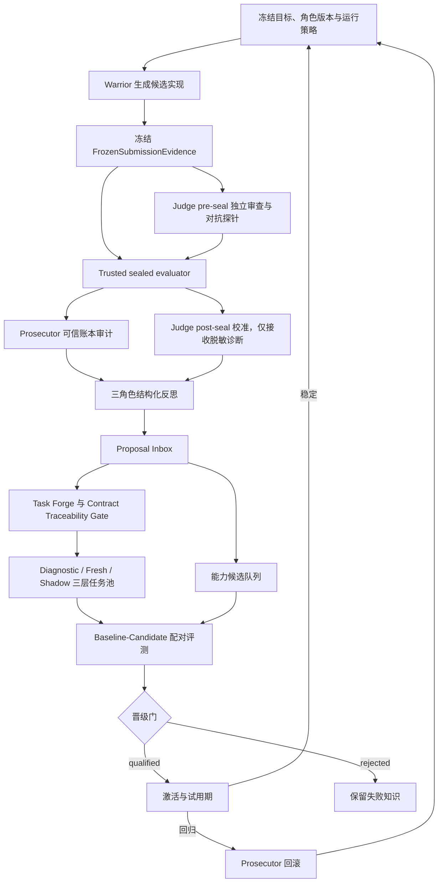

# AEGIS 三角色 E2E 架构审计与自主进化改进方案

> 审计日期：2026-08-14  
> 审计范围：2026-08-13 的 `jsonprompt`、`objective` 系列 E2E，Warrior、Judge、Prosecutor 的 submission、review、audit、reflection，以及 quality lock、task forge、candidate evaluation、attribution、qualification、activation 和 EventStore 状态。  
> 本文性质：只读审计与架构设计建议，不代表相关代码已经完成修改。

## 1. 结论摘要

最近几轮 E2E 暴露的并不只是“Judge 验证信号不可靠”，而是四条相互强化的失真链：

1. **证据链失真**：Judge 和 Prosecutor 没有挂载 Warrior 的冻结工作区，却被要求评判代码；模型只能依赖摘要、空目录或猜测。
2. **任务语义失真**：部分 hidden 断言没有被公开契约完整声明，sealed evaluator 虽然忠实执行测试，却不总是等价于“是否遵守已公开契约”。
3. **学习闭环失真**：三角色反思提出的关键改进没有进入可持续 proposal 队列；Fresh task 生产失败后仍被标为 `valid=true`，导致候选永久等待 holdout。
4. **治理账本失真**：归因记录把真实通过的安全与完整性写成 `false`，并仅把 Prosecutor 自身的模型用量当作周期成本，无法支撑可靠的自动晋级和经济治理。

这意味着当前系统已经具备较强的**安全隔离、内容寻址和 sealed execution 基础**，但尚未形成稳定的“发现弱点—形成可证伪假设—构造新鲜对抗证据—配对验证候选—晋级或回滚—保留可复用知识”的自主能力进化闭环。

改进方向不应是削弱 hidden evaluation、把隐藏用例直接暴露给模型，或把系统退化为固定测试流水线。正确方向是建立三个相互隔离的证据层：

- 可反馈的 **diagnostic arena**，用于产生可行动的失败类别；
- 不可反馈的 **rotating fresh promotion holdout**，用于决定晋级；
- 延迟披露的 **shadow audit set**，用于检测长期过拟合和能力遗忘。

同时，应把三角色从“自由文本评论者”升级为围绕可信证据工作的角色：Warrior 负责提出和实现能力变化，Judge 负责独立预测与构造对抗探针，Prosecutor 负责验证证据完整性、成本和治理边界；最终质量、完整性、安全和成本只能由控制面账本确定。

## 2. 审计方法和事实边界

### 2.1 权威证据优先级

本文按以下顺序判断事实：

1. EventStore 和内容寻址 artifact；
2. frozen `arm-workspace` 中的实际实现；
3. trusted sealed evaluator 的 `quality-lock`；
4. task pack 的 prompt、public case 和 hidden case；
5. 角色 action observation；
6. Warrior、Judge、Prosecutor 的自然语言陈述。

模型陈述只被视为观点或假设。若与冻结工作区、测试契约或控制面事件冲突，以控制面证据为准。

### 2.2 E2E 样本

六轮形成了可用 Judge review 和 quality lock；另有一轮在 submission 阶段因 gateway 错误终止。

| 运行 | Judge advisory | Locked quality | 低于满分的任务 | 结果 |
|---|---:|---:|---|---|
| `jsonprompt` | 0.78 | 0.90625 | atomic-counter、safe-join | 后续失败 |
| `jsonprompt-c` | 0.72 | 0.90625 | atomic-counter、safe-join | council token failure |
| `jsonprompt-d` | 0.82 | 0.90625 | atomic-counter、safe-join | completed，activation unchanged |
| `objective` | 0.00 | 0.9375 | safe-join | council token failure |
| `objective-b` | 0.78 | 0.875 | version-sort、atomic-counter、safe-join | completed，activation unchanged |
| `objective-c` | 0.86 | 0.875 | version-sort、atomic-counter、safe-join | completed，activation unchanged |

共同事实：

- 六轮都声称 12/12 public tests 通过；
- safe-join 6/6 轮未满分，atomic-counter 5/6，version-sort 2/6；
- 所有 quality lock 的 `evaluation.integrity_passed=true`；
- 完成后半周期的最近三轮均没有成功注册 Fresh task；
- 最近三轮 activation 全部 `unchanged=true`；
- 这些目录属于独立 campaign 和独立数据库，不能把它们误称为同一 campaign 的连续学习代际。

## 3. 目标架构原则

AEGIS 的主旨是“对抗式 AI 自主能力进化”，因此所有修复应满足以下原则：

1. **对抗性不能被削弱**：promotion holdout 继续对模型保密；不能为了减少误判而把答案交给角色。
2. **可学习性必须成立**：系统应提供不泄密但足以行动的 diagnostic feedback，否则反思只能猜判题器。
3. **证据与观点分离**：模型可以提出假设，不能自报质量、安全、完整性或成本真值。
4. **每次进化都必须可证伪**：proposal 必须声明目标失败模式、预期改善、保留约束和失败条件。
5. **晋级必须因果可归因**：同 cohort、同 seed、同预算策略的 baseline/candidate paired design 才能决定能力变化。
6. **失败也要产生知识**：任务生成失败、候选缺 holdout、协议错误和基础设施失败都应形成结构化结果，而不是被笼统的 `completed` 或自然语言掩盖。
7. **安全边界保持不可进化**：角色可进化 workflow、subject、plugin、environment 和受限 harness surface，但不能修改 sealed evaluator、权限、发布边界、安全账本或 promotion 规则。

## 4. 建议的总体闭环



## 5. 问题一：Judge 和 Prosecutor 看不到冻结提交

### 5.1 事实

当前 `review()` 只把 submission 的摘要放入 context，没有把 Warrior 的 `arm-workspace` 作为 `stage_workspace` 传给 Judge。`audit()` 同样如此。真正的冻结工作区随后才由 `lock_quality()` 从 CAS 取出并交给 sealed evaluator。

后果包括：

- 6/6 Judge review 在架构上都不能检查真实代码；
- 5/6 明确报告空工作区或无法复验；
- `objective` 轮因空目录给出 `quality_score=0.0`，而相同 submission digest 的 locked quality 为 0.9375；
- `objective-c` 声称做过 code inspection，但现有 action evidence 不能证明这一点；
- Prosecutor 也只能根据摘要和 hidden 分数推断根因。

### 5.2 根因

当前系统把“角色隔离”错误实现成了“角色失去必要的只读证据”。隔离要求 Judge 不能修改提交、不能读取 hidden tests，不等于 Judge 不能读取已经冻结的被评对象。

### 5.3 改进设计

新增可信值对象 `FrozenSubmissionEvidence`：

```text
submission_artifact_id
workspace_artifact_id
workspace_digest
workspace_size_bytes
producer_role_version_id
snapshot_id
cohort_id
freeze_receipt_id
```

控制面在 Warrior submit 后只创建一次该对象。Judge、Prosecutor 和 sealed evaluator 都从它派生自己的沙箱挂载：

- Judge：只读、无网络，只包含 prompt、public tests 和冻结 solution；
- Prosecutor：默认只读 artifact/receipt，可按需复验公开证据；
- sealed evaluator：读取相同 workspace bytes，但 hidden task material 仍只在控制面侧；
- 每个角色输出必须带 `verified_workspace_binding`，包含 artifact id、digest、size 和 mount receipt。

挂载失败应产生控制面状态 `verification_unavailable`，不能把它映射为 `artifact_absent` 或质量 0。

### 5.4 验收标准

1. 冻结一个包含已知文件的 workspace，Judge 能读取该文件且无法写入。
2. Judge mount digest、submission digest、sealed evaluator digest 三者完全相同。
3. 人为破坏 artifact bytes 时，角色启动前 fail closed。
4. 人为模拟 mount failure 时，Judge 输出 `verification_unavailable`，quality lock 仍能独立工作。
5. Judge 无法读取 reference、mutant 和 hidden case。

## 6. 问题二：Judge 信号的名称、时序和用途混乱

### 6.1 事实

当前事件顺序是：

```text
judge_reviewed -> quality_locked -> prosecutor_audited -> reflections
```

因此 Judge 首次评审时不可能看到 sealed delta。要求它“使用当前 sealed per-task delta 改善本轮评分”在时序上不可实现。Judge 的主观 `quality_score` 与系统 locked quality 使用相似名称，也容易被后续 council、task forge 和人工报告误认为同一类信号。

### 6.2 对自主进化的伤害

独立预测本来很有价值：它可以衡量 Judge 能否在不知道 hidden 结果时发现风险。但当前系统既没有把它定义成预测，也没有计算校准误差，导致错误分数只会污染后续讨论，而不能反过来改进 Judge。

### 6.3 改进设计

将 Judge 输出拆成三个 artifact：

1. `judge-preseal-assessment`
   - 每任务失败概率；
   - 置信度；
   - evidence coverage；
   - 已运行的公开或自建探针；
   - 明确禁止引用 live hidden 结果。
2. `judge-postseal-calibration`
   - 只接收 diagnostic 集的脱敏 clause 结果，或已经退役的 holdout 结果；
   - 计算 Brier score、校准误差、false-negative/false-positive 分类；
   - 产生下一版 Judge workflow proposal。
3. `locked-quality`
   - 仅由 trusted evaluator 生成；
   - 是 promotion 的硬质量信号；
   - Judge 不再生成同名 `quality_score`。

### 6.4 验收标准

- promotion 代码不能读取 Judge 主观分数；
- E2E 报告分别展示 forecast、calibration 和 locked quality；
- Judge 没有代码可见性时，`evidence_coverage<1` 且不能给出高置信结论；
- 使用一组退役任务验证 Judge 校准能够跨代改善，而不接触 live promotion holdout。

## 7. 问题三：公开任务契约与 hidden 断言不完全对齐

### 7.1 三个反复失败任务的真实表现

#### safe-join

公开 prompt 要求结果“remain inside root”，但没有明确 root 本身是否允许。hidden case 要求 `user_path="."` 抛出 `ValueError`，即结果必须是 root 的严格后代。最新冻结实现使用 `candidate.relative_to(base)`，会接受 root 本身。

此外，多轮角色把失败归因为 symlink，但这是模型假设，并非当前 hidden 失败的充分解释。

#### atomic-counter

公开 prompt 要求“reject non-integer amounts”，但没有声明异常必须是 `TypeError`，也没有明确 Python `bool` 是否算整数。多轮冻结实现已经使用 `threading.Lock`，实际仍会因 `bool` 或异常类型语义失败。把问题简单归因为“无锁并发”是错误诊断。

#### version-sort

公开 prompt 声明 missing trailing components 视为零，但未明确归一化后相等项应保持输入顺序。冻结实现直接用不同长度 tuple 排序，没有构造统一补零键。

### 7.2 根因

当前 TaskPack 只验证 reference 通过、defect/mutant 被杀，没有验证“每个 hidden 断言是否可追溯到公开契约”。这会把自主进化从“学习能力边界”退化为“猜隐藏判题器偏好”。

### 7.3 Contract Traceability Gate

TaskPack 新增公开的机器可读契约，例如：

```json
{
  "clauses": [
    {
      "clause_id": "PATH.STRICT_DESCENDANT",
      "statement": "resolved result must be a strict descendant of root",
      "input_partition": "root/self/descendant/escape",
      "expected_outcome": "return-or-ValueError",
      "security_relevant": true
    }
  ]
}
```

每个 public、diagnostic、hidden 和 mutant case 都必须引用一个或多个 clause ID。注册门必须检查：

- 输入域、返回值、异常类型、边界、状态变化、副作用、稳定性和并发语义是否明确；
- hidden 不得引入公开 clause 中不存在的语义；
- public/diagnostic 至少覆盖每个关键 obligation 的一个不同等价类；
- reference、defect 和 mutant 的预期行为均能映射到 clause；
- 安全相关 clause 必须有独立 adversarial case。

### 7.4 如何保持对抗性

公开 clause 不等于公开 hidden 输入。模型知道“必须严格位于 root 之下”，但不知道 promotion holdout 将使用哪种路径、平台、symlink 布局或规范化组合。这样既保证规则公平，又保留组合空间中的对抗性。

### 7.5 验收标准

- 删除或修改 prompt 中某个关键语义时，validator 能检测对应 hidden case 失去 clause 绑定；
- hidden case 引入未声明的异常类型时注册失败；
- safe-join、atomic-counter、version-sort 的现有不一致被 contract migration 明确处理；
- 新任务报告 clause coverage，而不只报告 case count。

## 8. 问题四：模型只能从分数猜根因，action evidence 又不足以审计

### 8.1 事实

当前角色 artifact 中的 observation 只保留 `{step, action}`。它能证明“调用过 sandbox.exec”，却不能证明执行了哪条命令、读了哪个文件、退出码是什么、结果是否支持结论。

同时，post-seal reflection 得到的常常只是每任务 pass/total 或 score。模型会用最显眼的通用风险填补证据空白，于是出现：已有锁却反复诊断为无锁、root-self 失败却反复诊断为 symlink。

### 8.2 改进设计：证据类型和 failure taxonomy

所有角色结论必须标注：

- `observed`：由可信 action receipt 或 evaluator receipt 支持；
- `inferred`：从多个事实推断；
- `hypothesis`：尚未验证；
- `self_reported`：仅来自另一模型摘要。

diagnostic evaluator 可返回不泄露具体输入的失败分类：

```text
STRICT_DESCENDANT_REQUIRED
EXCEPTION_TYPE_MISMATCH
NORMALIZED_EQUAL_STABILITY
STATE_TRANSITION_NONLINEARIZABLE
PUBLIC_CONTRACT_UNBOUND
```

action receipt 至少保存：

- action 名称和 schema version；
- 脱敏参数摘要、路径和 command digest；
- workspace/CAS digest；
- exit code、timeout、输出 digest；
- ActionError 类型、字段级 schema diff、是否重试；
- receipt 的产生者和 stage boundary。

原始可能含密内容继续留在短期受控存储，长期 artifact 只保留脱敏摘要与 digest。

### 8.3 验收标准

- “完成 code inspection”的 claim 必须至少引用一个 file-read receipt；
- 没有 receipt 的结论自动降级为 hypothesis；
- 同一失败类别在下一代可以关联前一问题，而不是产生新的重复自然语言记录；
- 审计工具可以从 claim 追溯到 action receipt、workspace digest 和 evaluator result。

## 9. 问题五：固定 hidden cohort 被反复反馈，存在黑盒过拟合

### 9.1 事实

六个 quality lock 都只有 12 个 regression task，Fresh task count 为零。反思阶段又向三个角色披露逐任务 hidden pass count，然后在独立运行中继续使用同一固定 cohort。

即使这些独立 campaign 不共享运行时学习状态，当前设计方向仍有风险：如果未来把反思 proposal 真正持久化，系统会不断对固定 hidden 分数做黑盒调参，使 promotion holdout 逐渐变成训练集。

### 9.2 三层对抗评测池

#### Diagnostic arena

- 可重复；
- 可返回 clause/failure taxonomy；
- 用于生成任务、修复 workflow 和校准 Judge；
- 不单独决定晋级。

#### Rotating fresh promotion holdout

- 每代新生成或从隔离池抽取；
- 对模型不披露逐任务结果和 clause 级诊断；
- 只返回 promotion gate 所需汇总；
- 至少包含一个 Fresh task，否则候选保持 `awaiting_holdout`，不能声称已评估。

#### Shadow audit set

- 长期保密、低频运行；
- 延迟若干代后才可释放粗粒度结果；
- 用于发现 diagnostic overfitting、能力遗忘和策略投机。

### 9.3 Promotion gate

晋级应同时满足：

- Fresh quality 达到最小改善；
- Hall-of-Fame regression 非劣；
- safety-critical clause 零失败；
- integrity 和 usage receipts 完整；
- 总成本没有超过策略上限；
- 多 seed paired result 满足置信阈值。

### 9.4 验收标准

- live Fresh 结果不会进入当前或下一轮模型 context；
- diagnostic 结果可以驱动 proposal，但不能直接触发 activation；
- 没有 Fresh 时 candidate 状态是 `awaiting_holdout`，不是 `validated improvement`；
- 注入一个只对 diagnostic 集过拟合的候选，shadow audit 能拒绝或回滚。

## 10. 问题六：反思 proposal 没有进入可持续进化队列

### 10.1 事实

当前 candidate consumer 读取本轮 Warrior 主 submission 中的 `evolution_requests` 和 `strategy_proposals`，以及 Prosecutor audit 中的部分候选。三个角色在 quality lock 之后形成的 reflection proposal 并不进入同一个消费闭环。

这解释了为何多轮反思持续提出 adversarial self-check，而真正进入 candidate evaluation 的仍是较早的 public-test/batch workflow；最新、更接近真实失败的建议只是文字记录。

### 10.2 Proposal Inbox

新增 append-only `ProposalInbox`，接受以下来源：

- Warrior submission；
- Judge pre/post-seal proposal；
- Prosecutor audit；
- 三角色 reflection；
- council decision；
- trusted anomaly detector。

建议状态机：

```text
proposed
  -> schema_validated
  -> evidence_bound
  -> admitted_for_experiment
  -> awaiting_holdout
  -> shadow_evaluated
  -> qualified | rejected | inconclusive
  -> activated
  -> retained | rolled_back
```

每个 proposal 必须包含：

- `proposal_id` 和 parent lineage；
- target role/surface；
- `problem_id`、失败证据和证据类型；
- 可证伪假设；
- 预期改善指标；
- retention/safety/cost 约束；
- 所需任务能力标签；
- 最大实验预算和过期条件。

相同 ID 和相同内容必须幂等成功；相同 ID 不同内容是冲突。多个等价提案可按 semantic fingerprint 合并。

### 10.3 验收标准

- reflection 中产生的 proposal 能在下一 cycle 被消费；
- dashboard 区分 collected、schema-valid、evidence-bound、behavior-evaluated 和 activated；
- 无 Fresh 时 proposal 保持可恢复的 pending 状态，并产生明确 obligation；
- proposal 过期、被拒绝或回滚后仍保留证据链，不会被反复重新提出。

## 11. 问题七：Fresh task 生产失败，却仍被记为有效

### 11.1 事实

最近三个走完 task-validation 的运行全部出现 `registered=[]` 和 `no_tasks_authored=true`，原因分别包括：

- task suite 目录出现不允许的文件；
- fixed-anchor/dynamic origin 冲突；
- Judge 根本没有写任何 draft。

但 `validate_forged_tasks()` 在零注册任务时仍返回 `valid=true`，周期继续走到 `completed`。

### 11.2 对进化闭环的伤害

Fresh task 是候选因果评测的必要资源。把“任务生产失败”当作“验证成功但没有任务”，会造成：

- candidate 永久停留在 `retained until a Fresh holdout cohort exists`；
- cycle 看似完成，实际学习链路空转；
- council hypothesis 无法得到证伪；
- 自动化监控无法识别任务供给饥饿。

### 11.3 改进设计

#### Canonical TaskPack Builder

模型负责声明任务意图、contract clauses、case specification、reference/defect/mutant 内容；控制面 builder 负责：

- 固定目录布局；
- manifest 和 content hash；
- task ID 预留与 origin 冲突检查；
- 文件白名单；
- 禁止 `__pycache__`/`.pyc`，运行时设置 `PYTHONDONTWRITEBYTECODE=1`；
- reference/public/hidden、defect、mutant 的统一 dry-run；
- 写入前的原子 validation transaction。

#### 明确结果语义

`task-validation` 应至少包含：

```text
status = registered | partially_registered | no_valid_task | infrastructure_failed
registered_count
rejected_count
required_fresh_count
learning_outcome = progressed | degraded | blocked_by_supply
reason_codes
remediation_obligations
```

当配置要求自主进化且存在 curriculum hypothesis 时，`registered_count=0` 不能是 `valid=true` 的成功结果。

### 11.4 保持任务生成的对抗性

不能把 Judge 降级成从固定模板复制题目。模型仍负责选择新失败面、构造能够杀死特定 mutant 的任务和提出跨能力组合；builder 只负责不值得由模型承担的机械正确性和安全边界。

### 11.5 验收标准

- task authoring 未执行任何成功写入时不能 submit success；
- duplicate anchor ID 在生成前得到明确冲突反馈并自动重新命名或拒绝；
- 生成过程不会把缓存文件带入 sealed suite；
- 有 hypothesis 的 E2E 至少注册一个 Fresh task，否则 cycle outcome 为 `learning_degraded`。

## 12. 问题八：候选晋级、试用、回滚和策略调节没有被本轮 E2E 真正覆盖

### 12.1 事实

最近三个完成后半周期的运行中：

- 一轮没有收集 candidate；
- 两轮收集并 schema-validated 一个 workflow candidate，但都因没有 Fresh holdout 而保持待定；
- candidate paired arms、qualification 和真实 activation 均未发生；
- activation artifact 全部为 `unchanged=true`；
- rollback orders 为空；
- 没有 runtime-policy amendment。

这些行为是正确的 fail-closed，但不能被当作“自主进化闭环已经通过 E2E”。

### 12.2 三周期真实验收场景

同一 campaign、同一 data root、连续三周期运行：

#### Cycle A：发现与供给

- baseline 暴露一个 diagnostic failure；
- reflection 产生带 evidence 的 workflow proposal；
- Judge forge 新 Fresh task；
- task 注册并保持 quarantined。

#### Cycle B：配对评测与晋级

- proposal 从 inbox 进入 candidate；
- baseline/candidate 使用冻结的同 cohort、seed、policy；
- Fresh 改善、HOF 非劣、成本和安全满足门槛；
- qualification 与 activation 都产生 changed receipt；
- 下一 stage/next cycle 确认真正使用新 role manifest。

#### Cycle C：回归与回滚

- 注入只在 shadow audit 或 probation 中触发的可控回归；
- Prosecutor 基于可信 receipt 发出 rollback order；
- active role set、EvolutionRegistry、必要时 Git champion 全部回到已认证祖先；
- candidate 保留为 rejected/rolled-back knowledge，不被立即重新激活。

另加 runtime policy 场景：制造可证明的成本异常，要求 Prosecutor 对下一非冻结 stage 调低请求或输出预算，并验证 paired design 的冻结策略不被中途改写。

### 12.3 Holdout reservation 与 design freeze

现有 `QUARANTINED + eligible_generation` 可以继续作为底层兼容状态，但应增加 first-class projection：

```text
PendingHoldoutRecord {
  task_artifact_id, source_proposal_id, creator_cycle, eligible_cycle,
  phase = pending | ready | reserved | consumed | accepted | rejected,
  reservation_id, cohort_id, evaluation_design_id,
  reserved_cycle, attempt_count, last_failure, revision
}
```

关键不变量：

- 同代生成的任务不能在同代用于晋级；
- 一个 Fresh task 同时只能绑定一个 evaluation design；
- paired evaluation 完成前不能提前进入 Hall-of-Fame；
- infrastructure failure 释放 reservation，不消耗 Fresh；
- candidate 必须先被冻结，任务才可 materialize，避免根据候选具体实现定制 promotion task；
- 模型不能看到 holdout reservation、hidden suite 或 live per-task result。

`CandidateEvaluationDesign` 应在任何 arm 执行前冻结并绑定：candidate、baseline champion、Fresh/HOF task IDs、至少两个 seeds、model、runtime image、plugin/MCP、runtime policy、sandbox policy、evaluator fingerprint 和 suite digests。baseline 与 candidate 的差异只能是被研究的 intervention。

### 12.4 Activation saga 与 probation

激活不是一次布尔写入，而应保持可补偿 saga：

```text
activation_intent
  -> checkpoint_previous_active_set
  -> probe_candidate
  -> commit_active_set
  -> mark_evolution_candidate_active
  -> publish_runtime_binding
  -> activation_receipt
```

任一步失败都必须补偿到旧 champion，或保持 `activation_incomplete` 交给 RecoverySupervisor，不能普通 completed。成功激活后创建 probation，绑定 immediate prior champion、所需周期数、新 Fresh 观测数和 rollback target。安全/完整性回归由控制面强制回滚；普通质量回归由可信 gate 产生 `rollback_required`，再由 Prosecutor 发出证据绑定的 order。

### 12.5 验收标准

- 不能只检查 artifact 是否存在；必须检查 candidate state、active set revision 和真实运行绑定变化；
- activation `unchanged=true` 只能证明安全收尾，不能证明进化成功；
- rollback 必须验证事件顺序、外部边界 receipt、registry champion 和下一次运行输入。

## 13. 问题九：反思发生得太早，无法总结完整生命周期

### 13.1 事实

当前 reflection/council 位于 task forge、task validation、candidate evaluation、attribution、qualification 和 activation 之前。三个角色的反思天然看不到：任务是否注册、candidate 是否因无 Fresh 饥饿、activation 是否 unchanged、归因字段是否错误。

### 13.2 改进设计

保留两层反思：

1. **Mid-cycle deliberation**：quality lock 后，用于提出任务和候选假设；
2. **Post-cycle postmortem**：activation 后，只读消费完整 artifact graph，用于判断闭环是否真正推进并形成下一周期 obligation。

postmortem 采用结构化 schema：

```text
problem_id
evidence_kind
evidence_refs
failed_stage_or_obligation
novelty
prior_problem_id
proposed_change_id
success_metric
confidence
falsifier
```

无新证据或新提案时，记录 recurrence count，而不是重复生成长篇反思。

### 13.3 验收标准

- postmortem 能明确指出 `no_tasks_authored`、`awaiting_holdout` 和 `activation_unchanged`；
- 模型自报 cycle number 被忽略，cycle ID 由控制面注入；
- 同一问题跨代自动关联并累计 recurrence，而不是形成多个孤立文本。

## 14. 问题十：归因账本的安全、完整性和成本来源错误

### 14.1 事实

最近三份 attribution arm 同时具有：

- 有效 quality；
- `usage_verified=true`；
- `safety_passed=false`；
- `integrity_passed=false`。

对应 quality lock 却明确 `evaluation.integrity_passed=true`，也没有 safety violation。根因是 `_evaluation_arm()` 从 Prosecutor 模型 submission 中读取 `safety_passed` 和 `integrity_passed`；这些字段不是稳定的 trusted schema，缺失后被转换成 false。

成本也只取 Prosecutor audit 本身的 input/output。按当前 artifact 中所有模型阶段的 usage 粗略汇总，最近三轮总模型 token 与 attributed cost 相差约 16.3 到 28.4 倍。即使该汇总还需由统一 ledger 去重，它已经足以证明当前 attribution cost 不是“全周期成本”。

### 14.2 改进设计

建立 `TrustedCycleEvidence`：

```text
quality = quality_lock.score
integrity_passed = quality_lock.evaluation.integrity_passed
safety_passed = trusted sandbox/safety receipts
usage = RuntimeLedger aggregate for exact cycle/stage/role/invocation
workspace_binding = FrozenSubmissionEvidence
policy_id = frozen/effective runtime policy receipt
```

模型字段改名为 `prosecutor_integrity_opinion`、`prosecutor_risk_findings`，只作为解释和异议，不得覆盖硬信号。

成本至少分解为：

- solve；
- review；
- sealed evaluation；
- audit；
- reflection/council；
- task forge/validation；
- candidate baseline/candidate arms；
- retry、malformed response 和 gateway failure；
- subagent usage。

所有请求在发出前和结束后都应有 attempt receipt，失败请求同样计费。

建议将底层计量统一为 append-only `CostEventV1`：

```text
cost_event_id
campaign_id / cycle_id / stage
invocation_id / attempt_id / action_id
paired_design_id / arm_id / role
resource_type
quantity / unit
verified
source_ref
pricing_version
usd_nanos
```

资源类型至少覆盖 provider input/output/cache/reasoning token、logical invocation、gateway attempt、sandbox CPU-second、memory GB-second、磁盘/网络、evaluator/scanner runtime、artifact storage、external API、retry/recovery waste 和尚未 settle 的 reservation。

报告必须同时提供三种不同用途的成本，不能混成一个 `cost_units`：

1. **paired causal cost**：baseline/candidate 在相同时间窗、相同计量项下的直接 solve + evaluator 成本，用于晋级；
2. **shared governance overhead**：Judge、Prosecutor、Council、task forge、validation、activation 等共享开销，不能伪分摊成候选因果效果；
3. **full-loaded cycle cost**：直接臂成本、共享治理、retry/recovery 和 stranded reservation 的总和，用于运营与容量规划。

账本必须满足守恒：

```text
sum(resource events)
  == sum(stage costs)
  == sum(role-owned + unowned costs)
  == cycle full-loaded total
```

`EvaluationArm` 应绑定 `cost_snapshot_id`，而不是从某个角色 artifact 临时抄一个裸数字。model、protocol、runtime image digest、policy、evaluator、workspace、task/cohort/seed、role generation 及实际 plugin/MCP receipts 也必须绑定在同一 arm provenance 中。

### 14.3 验收标准

- trusted quality lock 通过时，模型缺字段不能把 integrity/safety 写成 false；
- cycle cost 等于各 stage receipt 的去重总和；
- paired evaluation 的 baseline/candidate cost 使用相同计量口径；
- Prosecutor 可以对硬信号提出 objection，但不能篡改原值。

## 15. 问题十一：模型动作协议脆弱，机械错误消耗大量预算

### 15.1 事实

多轮出现缺少 `payload/summary`、非 `action/arguments` 输出、重复 submit、重复 strategy proposal、写文件转义错误和测试 cwd 错误。六轮 Warrior 合计产生大量请求和 token；Judge review/reflection 也出现重复 submit 和 `model.response` 异常。

这些不是“高级推理能力不足”，而是把本可由控制面保证的机械协议负担交给了模型。

### 15.2 改进设计

1. 每个 action 使用 versioned JSON Schema 或 typed tool call；
2. schema failure 返回字段级 diff，而不是一段泛化错误；
3. 只允许一次确定性 envelope normalization，仍失败才记模型错误；
4. `proposal_id + content_digest` 幂等；
5. submit 成功立即终止当前 role run；
6. 最后保留一个 recovery step，只允许修正 submit；
7. 代码写入统一使用原子 `workspace.write(content_base64)`，返回 file digest；
8. 测试命令和 cwd 从 task manifest 生成，模型只选择 task ID 和测试类别；
9. TASK/public 文件读取按 digest 缓存，避免每轮重复传输大段不变上下文。

建议持久化以下最小协议，而不是仅保存 action 名称：

```text
ActionEnvelopeV1 {
  protocol_version, action_id, campaign_id, cycle_id, stage,
  invocation_id, step, role, role_generation_id,
  policy_id, policy_revision, action_type, arguments,
  client_nonce, request_digest, previous_receipt_id?
}

ActionReceiptV1 {
  receipt_id, action_id, accepted, status,
  started_at, ended_at, duration_ms,
  argument_digest, result_digest, result_summary,
  error_code?, side_effect_refs[], resource_delta_id?,
  sandbox_digest, workspace_before_digest, workspace_after_digest,
  authority_snapshot_digest, recovery_source?
}
```

模型只提供 `action_type`、`arguments` 和 nonce；campaign、role、policy、workspace 与 authority snapshot 由控制器盖章。相同 `action_id + request_digest` 重放必须返回同一 receipt，相同 action ID 携带不同 body 必须冲突失败。

### 15.3 不应采取的方案

不应仅继续加长 system prompt。提示词可以解释角色目标，但不能替代 parser、schema、builder、幂等性和状态机。

### 15.4 验收标准

- malformed response 的平均恢复请求数不超过 1；
- 同一 proposal 重放不产生第二个 candidate；
- task runner 的 argv/cwd 在模型不可修改的 manifest receipt 中；
- 预算报告能区分 productive actions、schema recovery 和 infrastructure retry。

## 16. 问题十二：Council 把推理成本误当成消息长度

### 16.1 事实

两轮因 `council token limit exceeded` 失败。当前 `CouncilMessage.token_usage` 被赋值为一次 reflection 的累计 input + output usage，`CouncilTranscript.append()` 又拿它与 transcript token 上限比较。

一个只有几 KB 的最终 reflection，可能因为内部多轮推理消耗数十万 token 而被当作数十万 token 的“消息”拒绝。

### 16.2 改进设计

拆成两个互不替代的字段：

- `generation_cost_tokens`：来自 RuntimeLedger，用于经济预算；
- `message_content_tokens`：对 canonical council message 实际内容重新计数，只用于 transcript 限额。

Council context 不应重复回灌完整 submission、review、audit 和 reflection。控制面先构造紧凑 evidence index：claim、evidence refs、proposal、objection 和 decision fields；原 artifact 按需读取。

在启动 council 前做预算预检和角色配额预留，确保一个角色的冗长输出不会挤掉另外两个角色或最终裁决。

### 16.3 验收标准

- 增加 reflection 推理轮数但保持最终消息不变时，不会触发 transcript limit；
- 最终消息超长时仍能正确拒绝；
- generation cost 完整记入经济账本；
- council 能在任一角色达到配额时产生结构化 partial outcome，而不是丢失整轮状态。

## 17. 问题十三：失败恢复和 `completed` 语义不足以表示进化结果

### 17.1 事实

近期还出现：

- `runtime policy max_rounds exhausted`；
- `model relay unavailable after retries`；
- 两次 council token failure。

部分失败进入 recovery/rollback；部分周期虽然 `completed`，实际 task forge、candidate evaluation 和 activation 都没有推进。

### 17.2 改进设计

将技术终态与学习结果分开：

```text
execution_state = completed | failed | paused | recovered
task_outcome = solved | partially_solved | unsolved
learning_outcome = progressed | degraded | no_novel_evidence | infrastructure_blocked
candidate_outcome = none | awaiting_holdout | evaluated | qualified | rejected
activation_outcome = unchanged | activated | rolled_back
```

每个 stage 使用 artifact checkpoint 和幂等输入绑定。gateway 或 council 失败后从最后一个完整 stage 恢复，不能重复昂贵的 Warrior solve 和 sealed evaluation。恢复时必须验证 snapshot、policy、workspace 和前序 artifact digest 没有变化。

推荐所有阶段采用统一的 intent—receipt—commit 协议：

```text
StageCheckpointV1 {
  checkpoint_id, cycle_id, stage, attempt,
  input_digest, policy_id, role_generation_set_id,
  stage_intent_ids[], action_receipt_span, cost_event_span,
  output_artifact_refs[], state_before, state_after,
  next_stage, committed_at?
}
```

执行顺序：先写副作用 intent；再执行 action 并逐项写 receipt/cost event；然后冻结输出到 CAS；最后写 `stage_committed` 并推进状态机。恢复规则如下：

- checkpoint 已 commit 且 artifact digest 正确：直接从 `next_stage` 继续；
- 只有 intent：用 idempotency key 对外部系统执行 reconcile；
- artifact 缺失或损坏：fail closed；
- code、policy、role generation 或 input digest 已变：创建显式 recovery branch，不能静默复用旧 checkpoint；
- 新模型 invocation 使用新 ID，并通过 `supersedes` 关联旧 attempt。

### 17.3 验收标准

- `completed + learning_degraded + activation_unchanged` 可以被准确表达和告警；
- gateway failure 后恢复不会重新计入或重跑已经锁定的阶段；
- 独立 campaign 不会被报告成连续代际；
- report 明确区分“状态机走完”和“能力发生可归因改善”。

## 18. 问题十四：成本问题只停留在自然语言，策略调节没有形成受控闭环

### 18.1 事实

Prosecutor 多轮已经指出 token 浪费，但这些 finding 没有稳定转换为 runtime-policy amendment。当前工作区代码正在扩展即时 policy adjustment；即使功能可调用，也必须解决治理主体修改自身约束的风险。

### 18.2 风险

- Prosecutor 可能提高自己的输出或请求预算，挤占 Judge、evaluator、rollback 和最终 submit 的收敛预算；
- 角色根据单轮噪声频繁调节，产生策略震荡；
- paired evaluation 中途改变预算会破坏 baseline/candidate 可比性；
- 扩容突破 host/global envelope 会把经济治理变成安全绕过路径；
- amendment 若只存在自然语言，无法验证是否生效、何时生效及效果如何。

### 18.3 改进设计

控制流应为：

```text
ActionReceipt / CostEvent
  -> deterministic BudgetGovernor anomaly
  -> trusted telemetry snapshot
  -> Prosecutor typed amendment request
  -> PolicyEngine hard validation
  -> CAS append amendment
  -> next action boundary 生效
  -> Council ratify / revise / rollback
```

`PolicyAmendmentRequestV2` 至少包含：

```text
request_id
trigger_event_id
intent = shrink | reallocate | expand
base_policy_id
requested_boundary / effective_boundary
patch
protected_reserve_after
expected_effect
expiry_boundary
ratification_deadline
evidence_refs[]
```

硬规则：

- 自动路径只能缩减或在总预算内重分配；扩容需要 Council 或人工授权；
- 不能低于已消费量，也不能突破 host/global envelope；
- 当前 action 始终按旧 policy 记账，新 revision 从下一 action boundary 生效；
- 已冻结的 paired design 不受中途 amendment 影响；
- Prosecutor 增加自己的份额属于 self-dealing，需要额外批准；
- 必须为 Judge、evaluator、rollback 和最终 submit 保留 protected convergence reserve；
- 使用 hysteresis、cooldown 和单次 delta cap 防止震荡；
- 超过 ratification deadline 的临时 amendment 自动回滚。

### 18.4 验收标准

- 制造成本异常后，Prosecutor 产生 typed request，而不是只有 finding 文本；
- shrink 在下一 action 生效，触发它的当前 action 仍绑定旧 policy；
- 低于 consumed floor、突破 envelope 或自利扩容的 patch 被拒绝；
- paired design 在 amendment 后仍绑定原 policy；
- 同 request ID/同 body 幂等，不同 body 冲突；
- amendment 的预期效果在后续 CostEvent 中得到验证或触发自动回滚。

## 19. 问题十五：三角色使用同一模型，相关性偏差未被测量

### 19.1 风险

三角色都使用同一个 `deepseek-v4-flash`。不同 system role 能提供一定分工，但不能保证统计或认知独立；三者可能共同偏好同一种显眼解释，例如把 atomic-counter 问题统一归因为锁。

### 19.2 改进设计

- 使用独立 seed、不同 evidence view 和固定角色评分 schema；
- Judge 在 pre-seal 阶段不能读取 Warrior reasoning，只读冻结结果和公开契约；
- Prosecutor 优先运行确定性 integrity/cost/lifecycle checks，模型只解释异常和提出治理动作；
- 对高风险候选或校准漂移周期性使用异构第二模型复核；
- 记录跨角色 finding correlation，相关性过高且缺少独立证据时降低 council 置信度。

独立反思建议采用 commit-reveal barrier：

1. 控制面冻结共同的 `CommonEvidenceSet`；
2. 为每个角色冻结自己的 `RolePrivateEvidenceSet`；
3. 各角色并行或任意顺序生成反思，不能读取其他角色尚未提交的 narrative；
4. 三份反思先提交 digest；
5. 全部 commit 后才向 Council reveal；
6. 改变执行顺序时，每个角色的输入 digest 必须保持不变。

报告应显式标注独立性等级：`permission_isolated`、`context_blinded`、`runtime_isolated`、`model_diverse`、`statistically_independent`。同一基础模型的三角色最多称为“相同模型下的条件独立角色采样”，不能宣称统计独立。

不建议为了形式上的“多角色”固定使用三个昂贵模型。能由控制面确定的事实全部确定性计算，把模型预算保留给对抗任务设计、风险推理和新假设生成。

### 19.3 验收标准

- Judge context 不包含 Warrior 私有推理；
- Prosecutor 的完整性结果在模型完全不可用时仍能生成；
- 对一组已知缺陷测量三角色 finding diversity 和校准，而不只检查是否都输出文本。
- 改变三角色执行顺序后，各角色输入 digest 不变；
- reveal 前任一角色都不能读取其他角色 private trace 或 reflection；
- 同模型配置不会被错误标记成 `model_diverse` 或 `statistically_independent`。

## 20. 分阶段实施路线图

### Phase 0：恢复事实真值

优先级最高，目标是让现有报告不再说错话。

1. Judge/Prosecutor 绑定 `FrozenSubmissionEvidence`；
2. attribution 的 safety/integrity/cost 改为可信来源；
3. council message token 与 generation cost 分离；
4. `registered=0` 不再返回成功学习结果；
5. cycle summary 拆分 execution/learning/candidate/activation outcome；
6. 保存结构化 action receipts。

完成标准：同一 E2E 中所有角色、quality lock、attribution 和 report 对 workspace digest、完整性、成本和生命周期状态达成一致。

### Phase 1：建立公平且可学习的对抗评测

1. Contract clause schema 和 traceability validator；
2. 迁移现有 12 个 task pack；
3. diagnostic/fresh/shadow 三层任务池；
4. Judge pre-seal forecast 与 post-seal calibration；
5. failure taxonomy 和 evidence-kind schema。

完成标准：模型得到足够行动信息，但 live promotion holdout 没有泄漏；现有三项争议 hidden 语义全部有公开 clause。

### Phase 2：打通学习产物闭环

1. Proposal Inbox；
2. Canonical TaskPack Builder；
3. hypothesis/task/candidate lineage；
4. `awaiting_holdout` 与供给 obligation；
5. activation 后 postmortem；
6. problem recurrence 和 proposal 去重。

完成标准：一个 reflection proposal 可以跨周期进入候选，获得 Fresh evidence，并产生 qualified/rejected 的可追溯结论。

### Phase 3：验证真实自主进化和治理

1. 同 campaign 三周期 activate/rollback E2E；
2. runtime-policy amendment E2E；
3. probation 和 shadow audit；
4. 异构 Judge 校准抽检；
5. 长期 retention/generalization/cost 趋势。

完成标准：系统不只“生成 artifact”，而是能证明某项能力改善被新鲜对抗证据支持，并在回归时自动安全恢复。

## 21. 必须新增的关键测试

### 单元测试

- FrozenSubmissionEvidence schema、digest 和只读绑定；
- contract clause/case traceability；
- task-validation 零注册状态；
- proposal inbox 幂等、冲突、过期和 lineage；
- trusted attribution signal derivation；
- council 双 token 字段；
- action receipt 脱敏和 claim binding；
- cycle outcome 多维分类。
- CostEvent 守恒、ActionEnvelope/Receipt 重放与 policy amendment CAS。

### 集成测试

- Judge 读取冻结代码但不能读取 hidden；
- diagnostic feedback 可见、Fresh result 不可见；
- task forge 缓存文件、ID 冲突和未写 draft 三类失败；
- reflection proposal 下一周期被消费；
- baseline/candidate 相同 policy 的 paired evaluation；
- gateway failure 从 checkpoint 恢复且不重复记账。
- reflection commit-reveal 顺序无关性和 private evidence 隔离。

### 真实 E2E

- 三周期 Fresh→activate→rollback；
- 一个 diagnostic-overfit 候选被 shadow audit 拒绝；
- 一个高成本低收益候选触发 Prosecutor policy amendment；
- 一个 Judge mount failure 被报告为 verification unavailable 而非质量 0；
- report 能准确区分 completed、learning degraded 和 activation unchanged。

## 22. 风险与防护

| 风险 | 防护 |
|---|---|
| diagnostic feedback 导致过拟合 | promotion Fresh 不反馈逐任务结果；shadow audit 延迟披露 |
| Judge 只读挂载意外泄漏 hidden | 独立 workspace builder；显式文件 allowlist；digest receipt |
| 自动任务生成污染任务库 | quarantine、contract gate、reference/defect/mutant、origin 预检 |
| Proposal Inbox 无限增长 | content fingerprint 去重、TTL、优先级、实验预算和过期规则 |
| Prosecutor 自动调参振荡 | bounded patch、cooldown、回滚点、paired design 冻结、变化率上限 |
| action receipt 泄漏敏感输出 | 只持久化脱敏摘要和 digest；原文短期存储并受访问控制 |
| 多模型复核成本过高 | 只在高风险、校准漂移或随机抽检时启用 |
| 状态机复杂度增加 | append-only event、严格 schema、投影重放和逐阶段迁移 |

## 23. 不应采用的捷径

1. 不直接向 Warrior 或 Judge公开 live hidden case。
2. 不把 Judge 分数直接并入 locked quality。
3. 不通过简单提高 token 上限掩盖 council 计量错误。
4. 不把 `no_tasks_authored` 继续视为有效学习结果。
5. 不仅靠更长 prompt 修复 action schema 和 task layout。
6. 不因缺 Fresh 而降低 promotion 门槛；应修复任务供给并保持候选待定。
7. 不把六个独立 campaign 解释成已经发生跨代学习。
8. 不用“artifact 已生成”替代行为变化、激活和回滚验证。

## 24. 证据索引

### 最新 objective-c

- Judge review：`../.smoke-data-e2e-objective-20260813c/artifacts/judge-review/75292bb8bcefdc78acf478c71d9e4d02ea0a1d67c770e156d905147d8afe2e3a`
- Quality lock：`../.smoke-data-e2e-objective-20260813c/artifacts/quality-lock/8757b58881770c6fc4aa534613b742544b32b947919cc5070fe7b7f1e9733a0e`
- Prosecutor audit：`../.smoke-data-e2e-objective-20260813c/artifacts/prosecutor-audit/42f85ce79e26dcb6b6eb3e537836f9210ab916657585e1c97e8171fd9d578d20`
- Frozen workspace：`../.smoke-data-e2e-objective-20260813c/artifacts/arm-workspace/065464ca5e66f1a79a978e63f7c82a33ae029f6511809d067a9cad461d015421`
- Task validation：`../.smoke-data-e2e-objective-20260813c/artifacts/task-validation/5c468b1b3589142bfc32950eac780ba017f4c8c7a01c23e9dbb7e1e1c9c76554`
- Candidate evaluation：`../.smoke-data-e2e-objective-20260813c/artifacts/candidate-evaluation/e3d3fcf0dfe6ada25e3759cc4bf6f0f0282f6fd5d9972dc28b3a649250b7d931`
- Attribution：`../.smoke-data-e2e-objective-20260813c/artifacts/attribution/d3e8dc09d7a4a1fec94d7016d39db8b1882aae82a9bc1d80307467082d04ce67`
- Activation：`../.smoke-data-e2e-objective-20260813c/artifacts/activation/5ba9ea4e134d60bd2e982a50a694a1f8b8d5c0f5f0286e4f2fdd632c06881288`

### 关键源码

- 周期顺序：`../src/aegis/cycle_runtime.py`
- Judge/Prosecutor、quality lock、task forge、candidate evaluation、attribution：`../src/aegis/cycle_ports.py`
- Council message 和 transcript：`../src/aegis/council.py`
- Proposal consumer：`../src/aegis/evolution/consumer.py`
- TaskPack authoring 现有规则：`taskpack-authoring.md`

### 任务契约

- `../taskpacks/python/04_safe_join/prompt.md`
- `../taskpacks/python/04_safe_join/hidden/cases.json`
- `../taskpacks/python/09_atomic_counter/prompt.md`
- `../taskpacks/python/09_atomic_counter/hidden/cases.json`
- `../taskpacks/python/11_version_sort/prompt.md`
- `../taskpacks/python/11_version_sort/hidden/cases.json`

## 25. 最终判断

AEGIS 当前最值得保留的是：不可变控制面、CAS artifact、sealed evaluator、隔离沙箱、角色生命周期和 fail-closed activation。真正需要重构的是这些基础之上的**证据语义与学习闭环**。

改造完成后的系统不应只回答“模型这轮拿了多少分”，而应能够回答：

1. 这个弱点由什么可信证据发现？
2. 三个角色分别观察了什么、推断了什么、猜测了什么？
3. 公开契约是否足以定义失败？
4. 哪个可证伪 proposal 试图解决它？
5. 哪个新鲜对抗任务验证了泛化，而不是固定 hidden 过拟合？
6. 候选相对 baseline 改善了什么、牺牲了什么、花费了多少？
7. 为什么允许它晋级，或者为什么拒绝/回滚？
8. 这次结果如何改变下一代任务、工作流和治理策略？

只有当以上问题都能从可信账本和内容寻址证据中得到回答时，AEGIS 才真正实现“对抗式 AI 自主能力进化”，而不是一条带有三个模型角色的封闭测试流水线。
