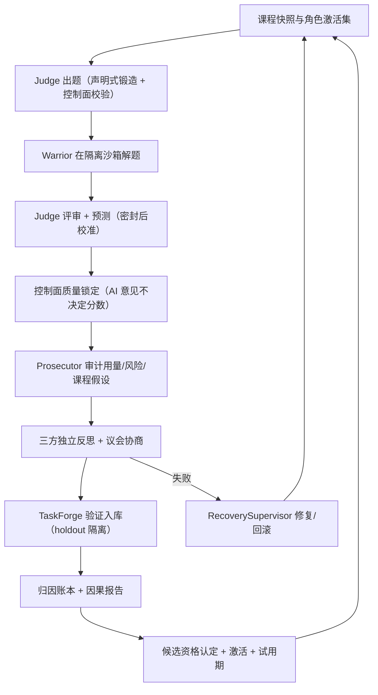

# 01 总览

## 定位

AEGIS（Adversarial Evolutionary Generative Intelligence System）验证一个主旨：**不更新模型权重，也能获得可验证、可归因、可回滚的持续能力提升**。提升的载体是围绕模型的整个 harness——任务课程、工作流、角色提示、插件、工具服务（MCP）、运行环境镜像，乃至 harness 自身的源码——全部作为可进化表面，由对抗性三角色循环驱动，经证据门控晋升。

## 三角色对抗循环

每个周期（cycle）执行一条固定的 19 态状态机流水线（详见 [07-cycle-state-machine](07-cycle-state-machine.md)）：

角色分工与互斥：

- **Warrior**（解题者）：在沙盒内解任务、提出进化候选（唯一可提议角色）。
- **Judge**（出题者）：评审、预测失败概率、锻造下一代任务。出题质量被下一代 cohort 客观检验。
- **Prosecutor**（检察官）：审计用量与证据完整性、裁决 objective 修正案、可下令回滚任何 champion、独享运行时策略修正权。

设计上的互斥：模型不能修改权限、预算、隐藏测试、评分、沙盒或晋升门（冻结面，见 [04](04-evolution-surfaces.md)）；Judge 的预测与质量锁定分离（AI 意见不决定分数，`judge.py:1-10`）；Prosecutor 对策略修正案的裁决权与对回滚的独占发起权形成制衡。

## 进化有效性的四层保证

1. **因果**：候选激活前必须通过同 cohort 配对影子评测（sealed 双臂、确定性派生种子），归因层证明候选是唯一变更坐标（[09](09-evaluation-attribution.md)）。
2. **门控**：多级非补偿闸——integrity/safety 失败不可被高分补偿；per-seed 灾难下限防均值掩盖（[08](08-candidate-lifecycle.md)）。
3. **对冲**：激活 ≠ 终点。非 harness 面 champion 有试用期（跨周期非劣观察，breach 即写事件诱导回滚）；harness 面 champion 由下一代 boot 探针与回滚令监管（[08](08-candidate-lifecycle.md) §试用期）。
4. **可逆**：一切 champion 变更走内容寻址事件流，检察官回滚令可把任何面翻回父代（[05](05-harness-evolution.md)、[18](18-recovery-activation.md)）。

## 信任分层哲学

系统把"模型可及的东西"分为四层（详见 [20-threat-model](20-threat-model.md)）：

| 层 | 内容 | 模型权限 |
|---|---|---|
| 冻结面 | 评测、沙盒、发布、记账、配置、控制面（[04](04-evolution-surfaces.md)） | 不可修改（frozen 字节比对强制） |
| 可进化面 | 七类表面：workflow/subject/plugin/environment/harness-code/mcp/control-core | Warrior 经协议提议，门控后激活 |
| 受信固定层 | 四个发行版 agent（supervisor/harness/sandbox/doctor）+ 网关 sidecar | 模型不可改；操作者经 provisioning 更新 |
| 边界外 | Windows 宿主、中继凭据、公网 | 模型不可见 |

关键不变量：**验证通过 ≠ 执行授权**（一切导入产物 `execution_granted=False`，`research/imports.py:1-6`）；**记账冻结**（`usage_accounting.py` 位于一切可进化根之外，agent 不能改产生自己预算数字的代码）。

## 代码地图

单包 `src/aegis/`，约 5.7 万行，零第三方运行时依赖（纯 stdlib）。分层：

- 基础层：`models.py`、`artifacts.py`、`event_store.py`、`execution_lock.py`、`envfile.py`
- 进化核心：`cycle_ports.py`（7.4K 行，周期端口实现）、`cycle_runtime.py`（阶段编排）、`evolution/*`
- 子系统：`agent_runtime.py`、`gateway/`、`sandbox/`、`research/`、`dynamic_tasks/`、`taskpacks/`、`curriculum/`、`attribution/`、`evaluation/`、`plugins/`、`mcp/`、`roles/`、`environments/`
- 治理：`runtime_policy.py`、`objectives.py`、`council.py`、`judge.py`、`strategy.py`
- WSL-first 运行时：`evolution/wsl_supervisor*.py`、`evolution/wsl_harness_agent.py`、`gateway_sidecar.py`、`wsl_cycle_runtime.py`

90 个测试文件、760+ 测试。文档分工：`docs/` 存验收台账与威胁模型；本 `wiki/` 是设计现状。
