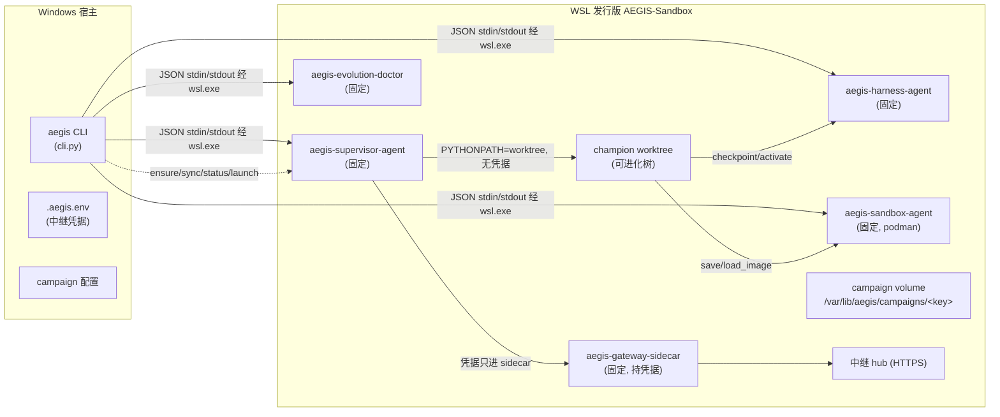

# 02 架构

## 定位

AEGIS 是双域系统：**Windows 宿主**（操作员环境、中继凭据、测试/开发）与 **WSL 发行版 `AEGIS-Sandbox`**（隔离执行域）。所有任务执行、harness 进化激活、真实生产 cycle 都发生在发行版内；宿主通过固定 JSON agent 协议跨域，绝不下发命令或路径。

## 双域拓扑



## 四个固定 agent + sidecar

发行版内 `/usr/local/bin/` 下五个固定入口（`sandbox/bootstrap.py:171-183` 生成薄 wrapper，import 固定安装的 aegis 包）：

| Agent | 模块 | 职责 | 信任性质 |
|---|---|---|---|
| `aegis-sandbox-agent` | `sandbox/agent.py` | 沙盒/构建/密封评测/镜像操作（[16](16-sandbox.md)） | 固定安装，协议接受数据不下发命令 |
| `aegis-harness-agent` | `evolution/wsl_harness_agent.py` | campaign git 仓库操作：checkpoint/validate/canary/activate/rollback/advance/sync（[05](05-harness-evolution.md)） | 同上 + frozen 字节比对 |
| `aegis-supervisor-agent` | `evolution/wsl_supervisor_agent.py` | 双层启动 champion、周期异步执行（[06](06-wsl-first-runtime.md)） | 同上；凭据只转给 sidecar |
| `aegis-gateway-sidecar` | `gateway_sidecar.py` | 唯一持中继凭据的进程；HTTPS 转发 + 计量 | 同上；SSRF 钉扎 |
| `aegis-evolution-doctor` | `evolution/wsl_deployment_agent.py` | 部署体检（interop/挂载/卷） | 只读 |

**刷新纪律**：源码改动后须 `pip install --force-reinstall --no-deps` 同步进发行版，否则运行的是旧 agent（`docs/autonomous-evolution.md` §5b.1）。

## 两种 cycle 执行路径

| 路径 | 条件 | 执行者 |
|---|---|---|
| 宿主 in-process | `test_mode` 或未启用 harness 进化（`cli.py` `_run_v2_cycle_cli` 分流） | 宿主 Python 进程跑 `run_v2_cycle`；沙盒仍经 wsl.exe 调发行版 |
| **WSL-first（生产）** | 非 test_mode 且 `harness_evolution_enabled`（`cli.py:_run_v2_cycle_wsl_first`） | 发行版内 supervisor 启动 champion worktree 执行全周期；宿主退化为薄客户端 |

## 数据布局

**宿主侧**（`--data-dir`，默认 `%LOCALAPPDATA%/AEGIS`）：
- `campaigns/<id>.json` 配置、`events.sqlite3`、`knowledge.sqlite3`、`skills.sqlite3`、`dynamic_tasks.sqlite3`、`artifacts/`（`cli.py:58-89`）。
- `.aegis.env`：git-ignored，8 键白名单中继配置（`envfile.py:16-28`）。

**发行版侧**（campaign volume，loopback ext4 ≤8GiB，`sandbox/bootstrap.py:20`）：
```
/var/lib/aegis/campaigns/<sha256(campaign_id)>/
├── repo.git/              # campaign bare 仓库（champion 血缘）
├── state.json             # source_url/source_ref/champion_commit/last_known_good
├── worktrees/             # champion-<sha12> 与 candidate-<token>
├── operations/            # agent 幂等回执（request_sha256 绑定）
├── candidates/<token>.json# meta_evolution_enabled 标志
├── cycles/gen-<N>/status.json  # 周期状态（固定 bootstrap 拥有）
└── data/                  # 周期数据根（WSL-first 生产路径）
    ├── events.sqlite3 / knowledge.sqlite3 / skills.sqlite3 / dynamic_tasks.sqlite3
    ├── artifacts/         # CAS 工件 + blobs/（镜像归档）
    ├── image_blobs.json   # 镜像 digest → 归档索引
    └── metering/gen-<N>.jsonl  # sidecar 计量
```

宿主路径与发行版路径**不共享**数据：WSL-first 生产 cycle 的全部事件/工件落在发行版 `data/` 下；宿主 `--data-dir` 服务宿主路径与测试。

## 传输原则

跨域只有一条通道：`wsl.exe --distribution AEGIS-Sandbox -- <agent>`，stdin 传 canonical JSON、stdout 收一行 JSON（`sandbox/wsl.py:169-175`、`evolution/wsl_supervisor.py:157-164`）。约束：

- 请求 ≤64KiB（`wsl_supervisor.py:26`），响应 ≤1MiB；
- 幂等回执按 `request_sha256` 绑定，重复 request_id 内容不同即拒绝；
- 发行版 `wsl.conf` 禁 interop 与 Windows 自动挂载（`bootstrap.py:192-195`），WSL→Windows 方向封闭；
- 瞬态传输失败重试 3 次（退避 5/15/30s，仅幂等操作，`sandbox/wsl.py:49-55`）。

## 信任层与执行隔离

- 任务容器：`podman run --network=none --cap-drop=ALL --read-only --pids-limit --memory --cpus --userns=keep-id`（`sandbox/agent.py:970-991`，资源可被策略信封覆盖）。
- boot 探针：`unshare --user --map-root-user --mount --pid --fork --kill-child` + `setpriv --no-new-privs --bounding-set=-all`（`wsl_supervisor_agent.py:343-363`）。
- 真实 cycle 执行器：不进 namespace（需 spawn 沙盒 agent/podman），以 generous rlimits（NOFILE 256/FSIZE 4GiB/CPU 8h/AS 4GiB，`wsl_supervisor_agent.py:616-629`）+ 树完整性（frozen 字节比对）+ sidecar 计量约束。

## 边界

- 宿主 CLI 调 supervisor/harness/sandbox/doctor/sidecar 五协议；反向（发行版→宿主）无通道。
- cycle_ports（7.4K 行）是周期端口的 frozen 实现：宿主路径与发行版路径共用（发行版内由 champion 树携带，经 frozen 字节比对与 pinned ref 保持一致）。
- `wsl_cycle_runtime.py` 是发行版内标准执行器：构造与宿主 CLI 等价的全部组件，但 sandbox/harness 用本地传输子类（`LocalAgentSandboxBackend`/`LocalHarnessBackend`），网关指向 sidecar（`wsl_cycle_runtime.py:1-40`）。
